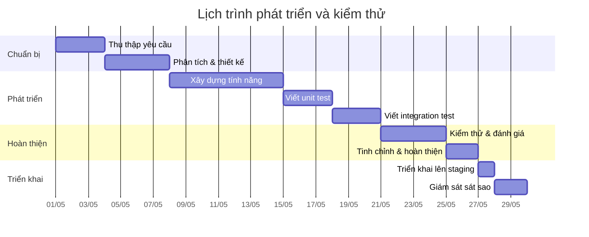

# Quy tắt sử dụng `CURSOR` trong Laravel (Tóm tắt điều hành)

【43†L1374-L1377】Laravel cung cấp phương thức `cursor()` để lặp qua tập kết quả lớn mà **chỉ thực hiện một truy vấn** và chỉ giữ một bản ghi Eloquent (hoặc một đối tượng *stdClass* với Query Builder) trong bộ nhớ tại mỗi thời điểm. Điều này giúp giảm thiểu việc sử dụng bộ nhớ so với các phương thức trả về toàn bộ kết quả cùng lúc. Tuy nhiên, do **PDO** nội bộ vẫn đệm toàn bộ kết quả trong bộ nhớ, nên với tập dữ liệu cực lớn, `cursor()` vẫn có thể gây ngốn bộ nhớ theo thời gian【43†L1374-L1377】. Trong tài liệu chính thức, phương thức `chunk()` được khuyến khích dùng cho các trường hợp xử lý từng khối nhỏ (ví dụ 100–1000 bản ghi) trong một *closure*, giúp chia nhỏ truy vấn và giảm bộ nhớ đệm【43†L1242-L1245】. Phương thức `lazy()` (kết quả là `LazyCollection`) kết hợp ưu điểm của `chunk()` và `cursor()`: thực hiện nhiều truy vấn nhỏ nhưng trả về một luồng kết quả liền mạch. Đây là những lựa chọn thay thế `cursor` trong Laravel khi xử lý dữ liệu lớn.

Đây là tài liệu chuyên sâu mô tả chi tiết cách **khi nào và làm sao sử dụng `cursor`** (và các phương pháp tương tự) trong dự án Laravel ở cấp độ senior. Chúng tôi trình bày mục đích, so sánh với các giải pháp khác, các ví dụ mã PHP/Laravel đầy đủ, thiết kế theo Service/Repository, DI, giao dịch, phân trang, streaming, xử lý lỗi và retry, ghi log/monitor, bảo mật (SQL injection, quyền hạn), chiến lược kiểm thử (unit, tích hợp, mock), lưu đồ luồng dữ liệu (Mermaid flowchart), lộ trình triển khai/kiểm thử (Mermaid Gantt), cũng như các lưu ý về migration, rollback, cấu hình môi trường và checklist code review.  

## Mục đích và trường hợp sử dụng Cursor vs các phương thức khác

【43†L1242-L1245】Phương thức `chunk($size, $callback)` trong Eloquent (hoặc `DB::table(...)->chunk($size, ...)`) sẽ truy xuất từng *khối* kết quả nhỏ (ví dụ 100 bản ghi) và đưa vào `Closure` để xử lý. Vì chỉ một khối nhỏ được nạp vào bộ nhớ mỗi lần, nó **giảm thiểu** bộ nhớ sử dụng khi làm việc với nhiều bản ghi【43†L1242-L1245】. Trong khi đó, `cursor()` chỉ khởi động **một truy vấn duy nhất** và sử dụng PHP **Generators** để sinh kết quả từng phần【43†L1374-L1377】. Chỉ một bản ghi Eloquent (hay một object `stdClass` với Query Builder) được giữ trong bộ nhớ mỗi lúc, giúp tiết kiệm bộ nhớ hơn `get()` hay `paginate()`. Tuy nhiên, với tập dữ liệu cực lớn, `cursor()` có thể **chậm hơn** vì liên tục gọi `PDOStatement::fetch` lặp lại, và bộ nhớ vẫn có thể bị đầy khi PDO đệm các hàng chưa fetch【5†L1435-L1439】. 

**Khi nên dùng `cursor`**: Nếu cần xử lý lần lượt từng bản ghi trên số lượng lớn (hàng trăm ngàn đến hàng triệu) mà không lo đầy bộ nhớ, và không cần eager load, `cursor()` hoặc `LazyCollection` là lựa chọn tốt. **So với chunk** thì cursor chỉ chạy 1 truy vấn, còn chunk chạy nhiều truy vấn giới hạn kích thước bằng `LIMIT/OFFSET`. Ví dụ, nếu muốn export toàn bộ dữ liệu lớn, có thể dùng `cursor()` để không tải hết dữ liệu trong bộ nhớ cùng lúc. Trong khi đó, **khi cần kiểm soát kích thước bộ nhớ chặt chẽ hoặc thực hiện updates trên bản ghi**, `chunkById()` hoặc `lazyById()` tốt hơn để tránh bỏ qua bản ghi khi dữ liệu thay đổi giữa các lần query (do `OFFSET` thay đổi)【43†L1277-L1284】. 

**Thuật ngữ phân trang (Pagination)**: `paginate()` và `simplePaginate()` dùng OFFSET làm cơ sở, phù hợp cho giao diện phân trang thông thường. Đối với giao diện scroll vô hạn hoặc bộ dữ liệu rất lớn, **cursor pagination** (`cursorPaginate`) sử dụng giá trị khóa (không OFFSET), hiệu suất tốt hơn và tránh bỏ sót/nhân đôi khi dữ liệu có ghi mới/ xóa giữa các trang【37†L344-L349】. Tuy nhiên `cursorPaginate` chỉ hiện Next/Prev và yêu cầu cột sắp xếp là duy nhất (thường là `id`). 

Tóm lại, `cursor()` và các biến thể Lazy Chunk phù hợp cho xử lý dữ liệu lớn “ngầm” (jobs, queues, export, stream), còn `paginate`/`simplePaginate` dùng cho giao diện phân trang người dùng. Việc **chọn phương pháp** cần dựa trên: kích thước dữ liệu, tính nhất quán khi cập nhật dữ liệu, khả năng eager load, và mục đích (UI hay xử lý batch). 

## Các phương pháp tiếp cận trong Laravel

### Sử dụng Eloquent và Query Builder

【43†L1374-L1377】Laravel Eloquent hỗ trợ `cursor()` trên **Model** builder: ví dụ `User::where(...)->cursor()`. Query Builder (`DB::table(...)`) cũng có `cursor()`. Cả hai đều trả về một `Illuminate\Support\LazyCollection`, tận dụng `yield` để chỉ giữ một dòng dữ liệu tại một thời điểm【43†L1374-L1377】. Ví dụ:
```php
foreach (App\Models\User::where('active', true)->cursor() as $user) {
    // Xử lý từng $user, mỗi vòng chỉ nạp 1 model
    echo $user->email;
}
```
Hoặc với Query Builder:
```php
foreach (DB::table('users')->orderBy('id')->cursor() as $row) {
    // $row là stdClass
    var_dump($row);
}
```
Sau khi iterate xong, Laravel sẽ tự hủy `LazyCollection`. Do `cursor()` dùng generator, không thể eager load quan hệ Eloquent (nó **chỉ load model khi foreach**). Nếu cần eager load, cân nhắc dùng `lazy()`.

【43†L1328-L1332】Phương thức `lazy()` (trong Eloquent hay `DB::table(...)->lazy()`) thực hiện tương tự `chunk()` ngầm định chia nhỏ truy vấn nhưng trả về một luồng kết quả liền mạch. Ví dụ:
```php
use Illuminate\Support\Facades\DB;
use App\Models\Flight;

DB::table('flights')->where('status','delayed')->lazy()
    ->each(function ($row) {
        // Xử lý $row là stdClass, tự động thực hiện nhiều query theo batch
    });

// Với Eloquent:
Flight::lazy()->each(function (Flight $flight) {
    // Xử lý $flight
});
```
`lazy()` tiết kiệm bộ nhớ hơn `get()`, tương tự `cursor()`, nhưng nó dùng nhiều query thay vì 1 query lớn. Thích hợp khi ta vẫn cần chỉ một bản ghi tại một thời điểm nhưng muốn tránh vấn đề bộ nhớ đệm quá lớn.

【43†L1242-L1245】Phương thức `chunk($size, $callback)` dành cho Eloquent hoặc Query Builder sẽ load mỗi lần `$size` bản ghi vào bộ nhớ rồi chạy callback, rồi lặp lại với bản ghi tiếp theo【43†L1242-L1245】. Ví dụ:
```php
App\Models\Flight::chunk(500, function ($flights) {
    foreach ($flights as $flight) {
        // Xử lý mỗi lô $flight (500 bản ghi)
    }
});
```
Hoặc với Query Builder:
```php
DB::table('users')->orderBy('id')->chunk(1000, function ($users) {
    foreach ($users as $user) {
        // Xử lý mỗi $user
    }
});
```
`chunk()` giúp giảm thiểu việc nạp tất cả kết quả vào memory cùng lúc. Tuy nhiên, `chunk()` thực hiện **nhiều truy vấn** (mỗi chunk là một query). Trong trường hợp cần update dữ liệu khi chunking, nên dùng `chunkById()` thay vì `chunk()`, để tránh bỏ sót (do `LIMIT/OFFSET` có thể bỏ qua bản ghi nếu có chèn/xóa giữa các query)【43†L1277-L1284】.

### PDO và các con trỏ (cursors) cơ sở dữ liệu

Laravel cho phép thực thi SQL thô thông qua PDO (qua `DB::select`, `DB::statement`, hoặc `DB::connection()->pdo()`). Nếu cần tương tác với **con trỏ cơ sở dữ liệu** (như trong Oracle hoặc PostgreSQL có con trỏ trong stored procedure), ta có thể dùng PDO thuần. Ví dụ:
```php
// Mở kết nối PDO, sử dụng CURSOR_SCROLL (nếu được hỗ trợ) để tạo con trỏ
$pdo = DB::connection()->getPdo();
$stmt = $pdo->prepare('SELECT * FROM big_table', [
    PDO::ATTR_CURSOR => PDO::CURSOR_SCROLL
]);
$stmt->execute();
while ($row = $stmt->fetch(PDO::FETCH_ASSOC, PDO::FETCH_ORI_NEXT)) {
    // Xử lý $row từng hàng
}
```
Theo tài liệu PHP, để sử dụng **con trỏ có thể cuộn** (scrollable cursor), phải gán `PDO::ATTR_CURSOR => PDO::CURSOR_SCROLL` khi prepare câu truy vấn【28†L199-L204】. Tuy nhiên, lưu ý: không phải mọi driver PDO đều hỗ trợ tính năng này (VD: MySQL PDO **không hỗ trợ** con trỏ cuộn, mặc định chỉ trả về con trỏ chỉ tiến (forward-only)). Nếu database hỗ trợ stored procedure với cursor (như Oracle), Laravel không trực tiếp gọi được nhiều cursor trong một procedure, nhưng có thể dùng package ngoài (ví dụ laravel-oci8) hoặc gọi thủ công. 

### Stored Procedures (Thủ tục lưu trữ)

Trong một số hệ quản trị (như Oracle, PostgreSQL), thủ tục lưu trữ (stored procedure) có thể trả về *REF CURSOR* (hay con trỏ tham chiếu). Laravel có thể gọi thủ tục qua `DB::statement('CALL my_proc(...)')` hoặc `DB::select('CALL my_proc(...)')`. Ví dụ:
```php
$results = DB::select('CALL get_users_with_cursor(?, ?)', [$param1, $param2]);
```
Nếu thủ tục trả về một con trỏ kết quả, PDO sẽ trả về tất cả kết quả như `fetchAll`. Để phát triển hơn (nhiều cursor cùng lúc), có thể dùng thư viện chuyên dụng. Tổng quan, nếu sử dụng stored procedure trả về tập kết quả lớn, việc xử lý tương tự: dùng `chunk` hay `cursor()` để lặp kết quả.

## Thiết kế Service/Repository và Dependency Injection

【43†L1242-L1245】【43†L1374-L1377】Để tách biệt logic truy cập DB và logic nghiệp vụ, nên áp dụng **Service/Repository pattern**. Ví dụ, tạo một repository chứa các phương thức lấy dữ liệu theo cursor:
```php
namespace App\Repositories;

use Illuminate\Support\Facades\DB;

class UserRepository {
    public function getActiveUsersCursor() {
        return DB::table('users')
                 ->where('active', true)
                 ->orderBy('id')
                 ->cursor();
    }
}
```
Sau đó, trong Service chúng ta inject repository này qua **Dependency Injection**:
```php
namespace App\Services;

use App\Repositories\UserRepository;

class UserService {
    protected $users;

    public function __construct(UserRepository $users) {
        $this->users = $users;
    }

    public function processActiveUsers() {
        foreach ($this->users->getActiveUsersCursor() as $user) {
            // Xử lý từng người dùng
        }
    }
}
```
Và Controller chỉ cần gọi Service:
```php
class UserController extends Controller {
    protected $service;

    public function __construct(UserService $service) {
        $this->service = $service;
    }

    public function exportActiveUsers() {
        $this->service->processActiveUsers();
        return response('Done');
    }
}
```
Với cách này, lớp Service/Repository dễ test (bằng cách mock repository), đồng thời tái sử dụng code truy vấn. Laravel's **Service Container** sẽ tự động khởi tạo và inject các phụ thuộc này.

## Giao dịch (Transactions), Rollback và Khôi phục

Khi thao tác dữ liệu (thêm, sửa, xóa) trong quá trình lặp, cần xem xét **giao dịch**. Laravel cung cấp `DB::transaction()` để chạy một loạt thao tác an toàn. Ví dụ:
```php
DB::transaction(function() use ($users) {
    foreach ($users as $user) {
        // ... update hoặc insert
    }
});
```
Trong khối transaction, nếu có lỗi (Exception) thì mọi thay đổi sẽ rollback tự động. Tuy nhiên, với tập bản ghi rất lớn, **không nên giữ giao dịch mở lâu** (gây lock bảng). Thay vào đó, có thể commit sau mỗi chunk nhỏ, hoặc **lưu trạng thái** sau mỗi batch để có thể hồi phục nếu gặp lỗi giữa chừng. Ví dụ, nếu xử lý 10,000 bản ghi và error tại bản ghi 7560, ta có thể đánh dấu vị trí cuối đã xử lý để từ đó resume. 

Đối với công việc xử lý nền (jobs, queue), nên tách thành các job nhỏ hơn (queue job có retry policy) để nếu thất bại có thể chạy lại từ đầu. Nếu cần hồi phục thủ công, hãy lưu thông tin vị trí/cursor hiện tại.

## Bảng so sánh các phương pháp (cursor, chunk, paginate, lazyCollection)

Để quyết định dùng phương thức nào, sau đây là bảng so sánh **ưu và nhược điểm, hiệu năng** (tham khảo tài liệu và thực nghiệm):

| Phương pháp                   | Mô tả                                                                 | Ưu điểm                                                            | Nhược điểm                                                        | Phù hợp khi…                      |
|-------------------------------|-----------------------------------------------------------------------|--------------------------------------------------------------------|------------------------------------------------------------------|------------------------------------|
| `cursor()`                    | LazyCollection một bản ghi / vòng, 1 truy vấn, dùng PHP Generator     | Ít tốn bộ nhớ (chỉ 1 bản ghi tại lần), chỉ 1 query               | Thường chậm hơn do fetch từng dòng; PDO vẫn đệm toàn bộ kết quả【5†L1435-L1439】; Không eager load | Khi cần xử lý dần từng bản ghi từ tập lớn (export, stream) |
| `chunk($n)` (Eloquent/DB)     | Lấy lần lượt từng khối `n` bản ghi, dùng nhiều query                 | Ổn định bộ nhớ (chỉ $n bản ghi), dễ xử lý trong closure           | Tốn nhiều query, có thể bỏ sót khi cập nhật/ghép (nên dùng chunkById)【43†L1277-L1284】 | Khi cần xử lý từng lô, và không cần luồng mượt |
| `lazy()`                      | Trả về LazyCollection qua nhiều truy vấn (mỗi lần lấy batch)        | Phân phối batch truy vấn, tải lỏng lẻo (lazy); có thể eager load từng batch nếu muốn | Mỗi batch vẫn fetch nhiều bản ghi, bộ nhớ ổn định tương tự chunk  | Khi muốn luồng đơn giản nhưng không muốn query toàn cục       |
| `paginate()`                  | Phân trang truy vấn, query count + limit/offset                     | Thích hợp UI có hiển thị số trang, dễ dùng qua Blade pagination   | Tốn count query (đếm tổng); với dữ liệu lớn OFFSET chậm           | Giao diện web phân trang thông thường                      |
| `simplePaginate()`            | Như paginate nhưng không count, chỉ Next/Prev                       | Nhanh hơn paginate, ít query hơn                                 | Chỉ Next/Prev, không hiện số trang; OFFSET yếu                       | Khi chỉ cần điều hướng Next/Prev, không cần trang cụ thể   |
| `cursorPaginate()`            | Phân trang theo cursor (giá trị cuối trang làm điều kiện `WHERE`)   | Hiệu suất tốt, không OFFSET trên bộ lớn (yêu cầu index); tránh skip/bật khi dữ liệu thay đổi【37†L344-L349】 | Chỉ Next/Prev, không hiện trang số; yêu cầu cột order duy nhất     | Scroll vô hạn, bộ dữ liệu lớn, cần ổn định khi cập nhật     |

## Code ví dụ và kịch bản

- **Ví dụ full code với Service/DI**: (đã trình bày ở trên).  
- **Sử dụng Transaction và Retry**:
    ```php
    $repo = new UserRepository();
    try {
        DB::transaction(function() use ($repo) {
            foreach ($repo->getActiveUsersCursor() as $user) {
                // Cập nhật hoặc xử lý
                $user->flag = true;
                $user->save();
            }
        });
    } catch (\Exception $e) {
        // Ghi log và quyết định retry
        Log::error("Lỗi khi xử lý users: " . $e->getMessage());
        // Có thể throw hoặc retry job tự động
    }
    ```
- **Streaming Responses**: Để trả dữ liệu lớn dưới dạng luồng HTTP (stream), Laravel cho phép:
    ```php
    return response()->stream(function() use ($repo) {
        foreach ($repo->getActiveUsersCursor() as $user) {
            echo $user->id . ',' . $user->email . "\n";
            flush();
        }
    }, 200, [
        "Content-Type" => "text/plain",
        "Content-Disposition" => "attachment; filename=\"users.csv\"",
    ]);
    ```
    Phương thức `stream()` đảm bảo bộ nhớ ổn định trong khi gửi dữ liệu dần cho client.
- **Xử lý lỗi/Pitfalls**:
  - Tránh sử dụng `cursor()` nếu cần eager load (relationships) vì `cursor()` không tải quan hệ trước. Thay vào đó có thể dùng `lazy()` và kết hợp `load()` thủ công sau mỗi batch.  
  - Với `chunk()` và `lazy()`, nếu cập nhật dữ liệu cùng điều kiện đang chunk, dùng `ById` thay vì OFFSET để tránh skip bản ghi【43†L1277-L1284】.  
  - Đảm bảo đặt `orderBy` rõ ràng khi dùng cursor hoặc lazy để kết quả ổn định.  
  - Nếu query quá phức tạp có thể dẫn đến timeout, cân nhắc tăng `DB::connection()->getpdo()->setAttribute(PDO::ATTR_TIMEOUT, ...)`.  
  - Kiểm soát kích thước batch (`chunk size`) qua cấu hình hoặc biến môi trường.

## Bộ nhớ và hiệu năng

【5†L1435-L1439】Theo tài liệu Laravel, mặc dù `cursor()` tiết kiệm bộ nhớ (chỉ 1 mô hình tại thời điểm), nhưng **PD​O driver** phía dưới vẫn đệm toàn bộ kết quả, nên với dataset cực lớn, bộ nhớ vẫn có thể bị đầy【5†L1435-L1439】. Trong khi đó, `chunk()` hoặc `lazy()` thực hiện nhiều query nhỏ, không cần đệm toàn bộ, do đó dễ dàng hơn với bộ nhớ hạn chế. Tuy nhiên, về mặt hiệu năng thô, `fetchAll` (được `get()` hay `paginate()` sử dụng) có thể nhanh hơn từng `fetch` của `cursor()`, nhưng đổi lại là bộ nhớ cao hơn【41†L269-L277】【41†L308-L312】. 

Tóm lại:
- Với **dữ liệu rất lớn**, `cursor()`/`lazy()` giúp ổn định bộ nhớ, nhưng nếu máy chủ còn dư RAM, `chunk()` cũng ổn khi xử lý tuần tự. 
- Về **thời gian thực thi**: `cursor()` có thể chậm hơn do overhead của generator, trong khi `chunk()` vì phải thực hiện nhiều query nên cũng cộng thêm độ trễ mạng. Cần thử nghiệm tuỳ từng tình huống để chọn phương pháp tối ưu. 
- Đảm bảo **tối ưu truy vấn**: luôn dùng index phù hợp (đặc biệt khi dùng cursor hoặc cursorPaginate yêu cầu cột sắp xếp phải có index), tránh các phép sắp xếp phức tạp hay join không cần thiết.

## Bảo mật và SQL Injection

【7†L189-L193】Laravel Query Builder và Eloquent tự động **bind tham số** để chống SQL Injection (đặt giá trị vào query qua parameter binding)【7†L189-L193】. Do đó, khi dùng `where`, `orderBy`, ... với tham số biến, không cần tự escape. Tuy nhiên, **không bao giờ cho phép người dùng chỉ định tên cột (column) trong query trực tiếp** do PDO không hỗ trợ bind tên cột【7†L193-L195】. Ví dụ: `DB::table('users')->orderBy($request->input('column'))` là không an toàn. Khi cần dynamic sort, hãy kiểm tra whitelist cột cho trước.

Với các đoạn SQL thô (`DB::raw` hoặc `DB::select('raw SQL ...')`), phải cẩn trọng: dùng binding (`?` hoặc `:param`) thay vì nối chuỗi người dùng. Phân quyền DB: user kết nối với DB nên có quyền **tối thiểu cần thiết** (READ-only cho thao tác SELECT, RW cho INSERT/UPDATE nếu cần). Không lộ thông tin database qua error message (hiển thị transaction rollback generic).

## Ghi log, giám sát (Monitoring) và Retry

Trong quá trình xử lý hàng loạt, nên **ghi log tiến độ** và lỗi. Ví dụ, mỗi 1000 bản ghi có thể ghi Log::info để báo tiến trình. Laravel có Telescope hay Monolog để giám sát queries và exceptions. Cấu hình `DB::listen` cũng cho phép ghi câu truy vấn thực thi (có thể hữu ích khi debug slow query trên tập lớn).

Nếu xử lý trong **queue job**, có thể tận dụng tính năng retry/backoff của Laravel để tự động chạy lại nếu bị ngoại lệ. Ví dụ dùng trait `InteractsWithQueue` và định nghĩa số lần retry. Đảm bảo catch exception trong job để ghi log rõ ràng, và không swallow exception (để job có thể retry).

## Phân trang và Streaming (Pagination & Streaming)

Đã đề cập **cursor pagination** ở trên: với `cursorPaginate($perPage)` (Eloquent hoặc Query Builder), Laravel xây dựng truy vấn sử dụng `WHERE id > last_id` thay vì OFFSET, cho hiệu suất tốt trên tập lớn【37†L344-L349】. Ví dụ:
```php
$users = User::where('status', 'active')->orderBy('id')
             ->cursorPaginate(15);
```
Nhớ thêm `orderBy` gồm khóa chính để cursor hoạt động đúng. Kết quả là `CursorPaginator` cho phép Next/Prev link. 

Về **streaming**, khi cần trả dữ liệu dần cho client (phân tán tải, báo cáo CSV, export), có thể dùng `Response::stream` như ví dụ ở trên. Dùng `stream` cho phép server gửi dữ liệu từng phần mà không cần đợi toàn bộ xử lý xong. Nên flush (`flush()`) sau mỗi output để đảm bảo dữ liệu tới client đúng thời điểm.

```mermaid
flowchart LR
    Client[Khách hàng (HTTP Client)] -->|Yêu cầu GET/POST| Controller[Controller]
    Controller -->|Gọi Service xử lý| ServiceLayer[Dịch vụ (Service)]
    ServiceLayer -->|Lấy dữ liệu qua ORM| ORM[Eloquent/Query Builder]
    ORM -->|Thực hiện truy vấn| DB[(Cơ sở dữ liệu)]
    DB -->|Trả dữ liệu | ORM
    ORM -->|Dữ liệu cho| ServiceLayer
    ServiceLayer -->|Trả kết quả| Controller
    Controller -->|Trả luồng data| Client
    classDef db fill:#FFFBCC,stroke:#333,stroke-width:2px;
    class DB db
```

## Kiểm thử (Unit, Integration, Mocks)

Kiểm thử là bắt buộc cho code phức tạp này. **Unit tests** nên tập trung vào logic trong Service/Repository bằng cách **mock** (giả lập) phần gọi DB. Ví dụ, mock `UserRepository::getActiveUsersCursor()` trả về một `LazyCollection` mẫu, rồi kiểm tra Service có xử lý đúng. Laravel cho phép dùng `Mockery` hoặc `PHPUnit` để tạo mock, và `Illuminate\Support\Collection::make()` để sinh LazyCollection test dễ dàng.

【48†L267-L270】**Integration tests** có thể sử dụng trait `RefreshDatabase` (hoặc `DatabaseMigrations`) để tái tạo cơ sở dữ liệu sau mỗi test【48†L267-L270】. Điều này đảm bảo dữ liệu test luôn nhất quán. Ví dụ, viết test Feature mà seed vài bản ghi nhỏ, sau đó gọi route xử lý cursor rồi assert kết quả mong đợi (vd. file được xuất thành công, hoặc dữ liệu đã được cập nhật). Laravel hỗ trợ in-memory SQLite hay dùng MySQL/Postgres trên CI.

### Ví dụ kiểm thử
```php
public function testProcessActiveUsers() {
    // Sử dụng RefreshDatabase trait
    User::factory()->count(5)->create(['active' => true]);
    User::factory()->count(3)->create(['active' => false]);

    // Gọi service xử lý
    $service = app(UserService::class);
    $service->processActiveUsers();

    // Kiểm tra đã đánh dấu đúng 5 user active
    $this->assertDatabaseHas('users', ['active' => false, 'processed' => true]);
    // hoặc các kiểm tra logic tương ứng...
}
```
Trong unit test, nên mock repository:
```php
public function testServiceCallsRepositoryCursor() {
    $mockRepo = \Mockery::mock(UserRepository::class);
    $mockRepo->shouldReceive('getActiveUsersCursor')
             ->andReturn(collect([ (object)['email'=>'test@example.com'] ]));
    $service = new UserService($mockRepo);
    // Gọi service và verify xử lý trên mock
}
```

## Migration, Schema và Lưu ý khác

- **Schema**: Đảm bảo các cột dùng để sắp xếp/phân trang (VD: `id`, `created_at`) có **index** để truy vấn với `ORDER BY` hoặc `WHERE` nhanh. Nếu dùng phân trang theo `cursorPaginate`, cột làm cursor nên là khóa chính (hoặc một cặp (unique) khóa).
- **Kiểu dữ liệu lớn**: Nếu truy vấn cột TEXT/BLOB lớn, cân nhắc sử dụng `cursor()` để không phải nạp toàn bộ BLOB vào bộ nhớ. 
- **Migration**: Không có yêu cầu migration đặc biệt cho cursor, nhưng nên xem xét phân vùng (partition) nếu lượng dữ liệu quá khổng lồ, hoặc lịch "archive" để xử lý dữ liệu cũ.
- **Quan hệ**: Nếu cần tải quan hệ với kết quả lớn, tốt nhất tách query chính và query phụ. Có thể lấy primary keys qua cursor rồi batch eager load theo nhóm.

## Triển khai và Cấu hình

- **Môi trường**: Đặt biến môi trường cho kết nối DB (`DB_CONNECTION`, `DB_HOST`, v.v.) phù hợp với môi trường staging/production. Có thể thêm biến `CURSOR_CHUNK_SIZE` để cấu hình kích thước chunk động nếu cần.
- **Cấu hình PDO**: Laravel hỗ trợ thiết lập qua `config/database.php`. Ví dụ, đối với SQL Server có thể cấu hình scrollable cursors. Đối với MySQL, mặc định sử dụng buffered queries; nếu muốn stream không đệm, dùng `PDO::MYSQL_ATTR_USE_BUFFERED_QUERY => false` (thận trọng nếu server cũ).
- **Rollback & Recovery**: Khi deploy, nên có kế hoạch rollback schema nếu migration mới ảnh hưởng đến cách xử lý lớn. Sử dụng `php artisan migrate:rollback` khi cần và luôn test rollback migration trong staging.
- **Queue/Batch**: Với công việc lớn, cân nhắc Laravel Queue hoặc Batch (Laravel 8+) để chia nhỏ task, dễ resume và monitor qua dashboard.



## Điểm kiểm tra (Checklist) cho Code Review

- **Chọn phương pháp**: Đã xác định đúng `cursor`, `chunk`, `lazy` hay phân trang phù hợp với yêu cầu? Không sử dụng `get()` cho data lớn.
- **Truy vấn và bảo mật**: Tất cả các điều kiện, cột được bind hợp lệ (không cho người dùng nhập cột raw)? Đã xử lý injection đúng cách【7†L189-L193】.
- **Kiến trúc**: Sử dụng Repository/Service để dễ test và bảo trì? Có DI cho dependency không?
- **Transaction**: Có cần wrap trong transaction không? Cẩn thận lock cho tập lớn. Đã handle exception/Rollback? Có kế hoạch recovery?
- **Performance**: Có index cho các cột dùng ORDER/BY `cursor`? Đã đo/test hiệu năng (benchmark trên lượng dữ liệu dự tính)? So sánh `cursor` vs `lazy` vs `chunk` nếu cần.
- **Bộ nhớ**: Kịch bản xử lý có thể gây full bộ nhớ không? Đã kiểm thử với lượng dữ liệu lớn trên dev? Đã xem xét `lazy()` nếu `cursor()` vẫn ngốn?
- **Phân trang/Streaming**: Nếu xây UI, đã dùng `cursorPaginate` hay `paginate` đúng ngữ cảnh? Nếu export/dump dữ liệu, đã dùng streaming response?
- **Logs/Monitoring**: Đã ghi log cần thiết (bắt lỗi, tiến độ)? Đã xử lý retry/backoff khi lỗi? Đã cấu hình monitoring (Telescope, QL, etc) không?
- **Kiểm thử**: Có unit test cho logic (mock DB)? Có integration test (RefreshDatabase)? Đã test migration rollback?
- **Đa phiên bản Laravel**: Đã kiểm tra tính tương thích (8.x, 9.x, 10.x)? Ví dụ, `cursor()` và `lazy()` có mặt từ Laravel 8 trở lên. Nếu ứng dụng dùng phiên bản cũ, có cần polyfill hay giải pháp khác?
- **Tài liệu**: Mã nguồn đi kèm comment/README giải thích cách dùng, lưu ý constraint (tài liệu nội bộ, markdown).

## Kết luận

Sử dụng `cursor` và các phương thức lặp chunk/lazy trong Laravel giúp xử lý khối lượng dữ liệu lớn hiệu quả hơn so với load toàn bộ vào bộ nhớ. Cần cân nhắc kỹ trade-off giữa bộ nhớ và hiệu năng, đồng thời tuân thủ các best practice về kiến trúc, bảo mật và kiểm thử. Tài liệu này cung cấp hướng dẫn đầy đủ cho một developer có kinh nghiệm xây dựng giải pháp dựa trên `cursor` trong Laravel, với ví dụ cụ thể và checklist đảm bảo chất lượng.

**Nguồn tham khảo:** Laravel documentation (Query Builder & Eloquent)【43†L1242-L1245】【43†L1374-L1377】, PHP PDO manual【28†L199-L204】.