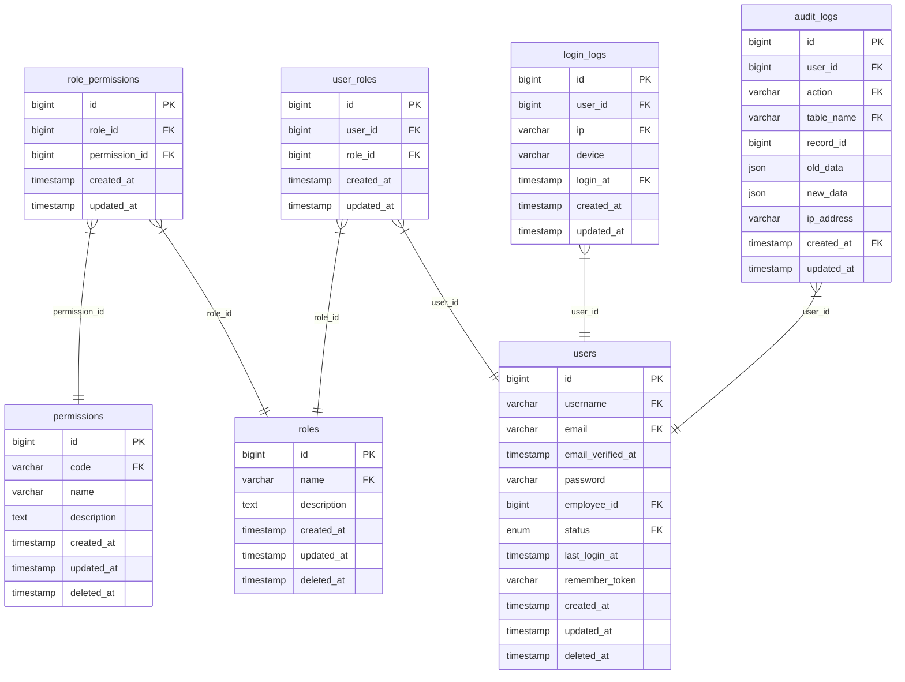
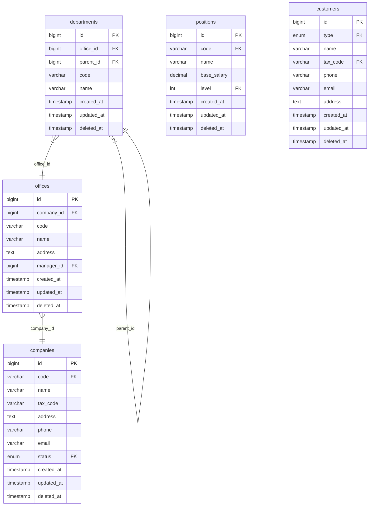
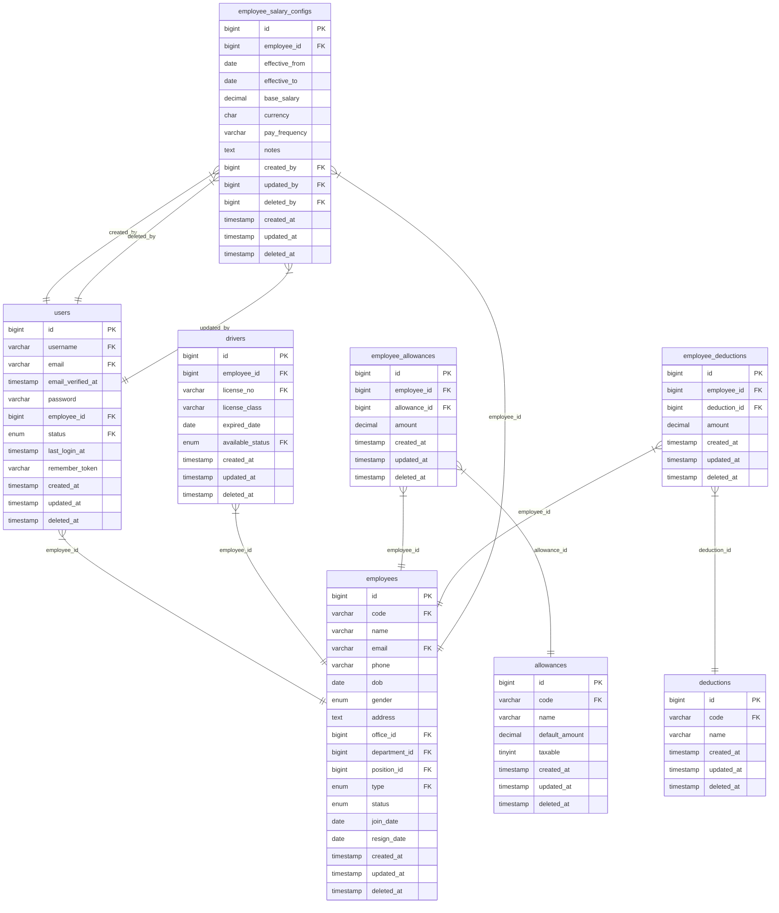
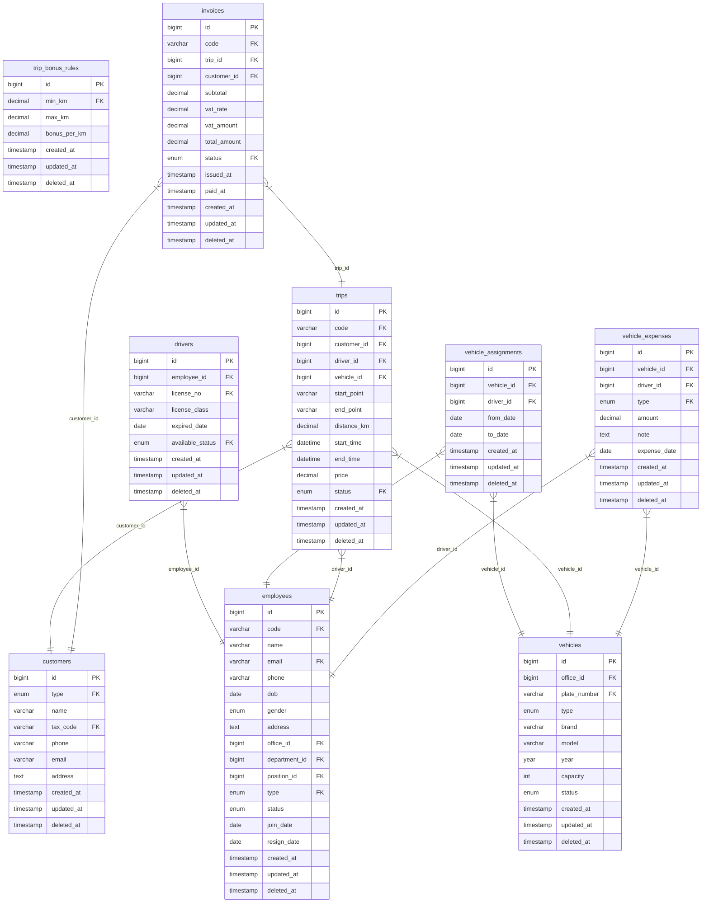
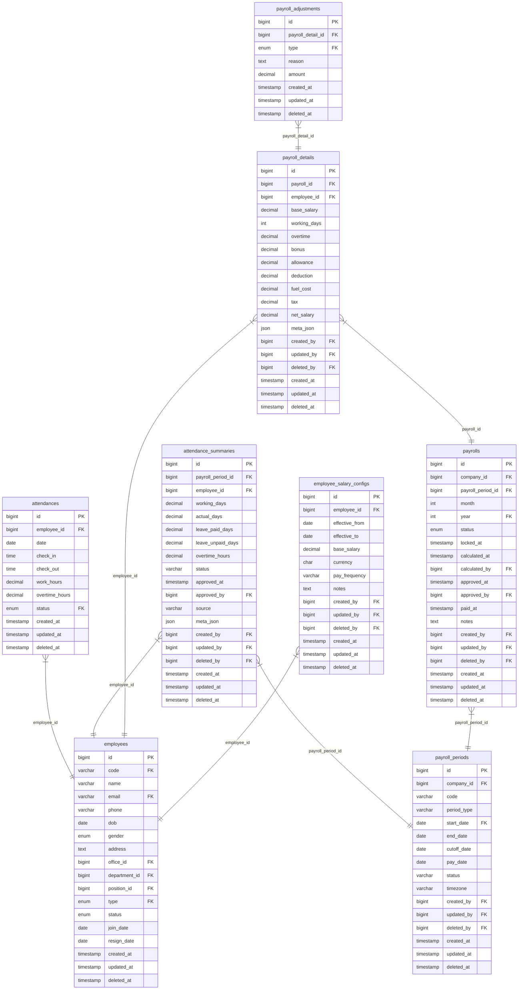

# 2.4. Thiết kế cơ sở dữ liệu

Tài liệu mô tả các mô hình cơ sở dữ liệu của hệ thống Company Ship.

## Hình 2.5(1). Mô hình cơ sở dữ liệu tổng thể của hệ thống

```mermaid
erDiagram
    allowances {
        bigint id PK
        varchar code FK
        varchar name 
        decimal default_amount 
        tinyint taxable 
        timestamp created_at 
        timestamp updated_at 
        timestamp deleted_at 
    }
    attendance_summaries {
        bigint id PK
        bigint payroll_period_id FK
        bigint employee_id FK
        decimal working_days 
        decimal actual_days 
        decimal leave_paid_days 
        decimal leave_unpaid_days 
        decimal overtime_hours 
        varchar status 
        timestamp approved_at 
        bigint approved_by FK
        varchar source 
        json meta_json 
        bigint created_by FK
        bigint updated_by FK
        bigint deleted_by FK
        timestamp created_at 
        timestamp updated_at 
        timestamp deleted_at 
    }
    attendance_summaries }|--|| users : "approved_by"
    attendance_summaries }|--|| users : "created_by"
    attendance_summaries }|--|| users : "deleted_by"
    attendance_summaries }|--|| employees : "employee_id"
    attendance_summaries }|--|| payroll_periods : "payroll_period_id"
    attendance_summaries }|--|| users : "updated_by"
    attendances {
        bigint id PK
        bigint employee_id FK
        date date 
        time check_in 
        time check_out 
        decimal work_hours 
        decimal overtime_hours 
        enum status FK
        timestamp created_at 
        timestamp updated_at 
        timestamp deleted_at 
    }
    attendances }|--|| employees : "employee_id"
    audit_logs {
        bigint id PK
        bigint user_id FK
        varchar action FK
        varchar table_name FK
        bigint record_id 
        json old_data 
        json new_data 
        varchar ip_address 
        timestamp created_at FK
        timestamp updated_at 
    }
    audit_logs }|--|| users : "user_id"
    companies {
        bigint id PK
        varchar code FK
        varchar name 
        varchar tax_code 
        text address 
        varchar phone 
        varchar email 
        enum status FK
        timestamp created_at 
        timestamp updated_at 
        timestamp deleted_at 
    }
    customers {
        bigint id PK
        enum type FK
        varchar name 
        varchar tax_code FK
        varchar phone 
        varchar email 
        text address 
        timestamp created_at 
        timestamp updated_at 
        timestamp deleted_at 
    }
    deductions {
        bigint id PK
        varchar code FK
        varchar name 
        timestamp created_at 
        timestamp updated_at 
        timestamp deleted_at 
    }
    departments {
        bigint id PK
        bigint office_id FK
        bigint parent_id FK
        varchar code 
        varchar name 
        timestamp created_at 
        timestamp updated_at 
        timestamp deleted_at 
    }
    departments }|--|| offices : "office_id"
    departments }|--|| departments : "parent_id"
    drivers {
        bigint id PK
        bigint employee_id FK
        varchar license_no FK
        varchar license_class 
        date expired_date 
        enum available_status FK
        timestamp created_at 
        timestamp updated_at 
        timestamp deleted_at 
    }
    drivers }|--|| employees : "employee_id"
    employee_allowances {
        bigint id PK
        bigint employee_id FK
        bigint allowance_id FK
        decimal amount 
        timestamp created_at 
        timestamp updated_at 
        timestamp deleted_at 
    }
    employee_allowances }|--|| allowances : "allowance_id"
    employee_allowances }|--|| employees : "employee_id"
    employee_deductions {
        bigint id PK
        bigint employee_id FK
        bigint deduction_id FK
        decimal amount 
        timestamp created_at 
        timestamp updated_at 
        timestamp deleted_at 
    }
    employee_deductions }|--|| deductions : "deduction_id"
    employee_deductions }|--|| employees : "employee_id"
    employee_salary_configs {
        bigint id PK
        bigint employee_id FK
        date effective_from 
        date effective_to 
        decimal base_salary 
        char currency 
        varchar pay_frequency 
        text notes 
        bigint created_by FK
        bigint updated_by FK
        bigint deleted_by FK
        timestamp created_at 
        timestamp updated_at 
        timestamp deleted_at 
    }
    employee_salary_configs }|--|| users : "created_by"
    employee_salary_configs }|--|| users : "deleted_by"
    employee_salary_configs }|--|| employees : "employee_id"
    employee_salary_configs }|--|| users : "updated_by"
    employees {
        bigint id PK
        varchar code FK
        varchar name 
        varchar email FK
        varchar phone 
        date dob 
        enum gender 
        text address 
        bigint office_id FK
        bigint department_id FK
        bigint position_id FK
        enum type FK
        enum status 
        date join_date 
        date resign_date 
        timestamp created_at 
        timestamp updated_at 
        timestamp deleted_at 
    }
    employees }|--|| departments : "department_id"
    employees }|--|| offices : "office_id"
    employees }|--|| positions : "position_id"
    export_logs {
        bigint id PK
        bigint user_id FK
        varchar type FK
        varchar file_name 
        varchar file_path 
        int record_count 
        timestamp created_at 
        timestamp updated_at 
        timestamp deleted_at 
    }
    export_logs }|--|| users : "user_id"
    invoices {
        bigint id PK
        varchar code FK
        bigint trip_id FK
        bigint customer_id FK
        decimal subtotal 
        decimal vat_rate 
        decimal vat_amount 
        decimal total_amount 
        enum status FK
        timestamp issued_at 
        timestamp paid_at 
        timestamp created_at 
        timestamp updated_at 
        timestamp deleted_at 
    }
    invoices }|--|| customers : "customer_id"
    invoices }|--|| trips : "trip_id"
    login_logs {
        bigint id PK
        bigint user_id FK
        varchar ip FK
        varchar device 
        timestamp login_at FK
        timestamp created_at 
        timestamp updated_at 
    }
    login_logs }|--|| users : "user_id"
    offices {
        bigint id PK
        bigint company_id FK
        varchar code 
        varchar name 
        text address 
        bigint manager_id FK
        timestamp created_at 
        timestamp updated_at 
        timestamp deleted_at 
    }
    offices }|--|| companies : "company_id"
    offices }|--|| employees : "manager_id"
    payroll_adjustments {
        bigint id PK
        bigint payroll_detail_id FK
        enum type FK
        text reason 
        decimal amount 
        timestamp created_at 
        timestamp updated_at 
        timestamp deleted_at 
    }
    payroll_adjustments }|--|| payroll_details : "payroll_detail_id"
    payroll_details {
        bigint id PK
        bigint payroll_id FK
        bigint employee_id FK
        decimal base_salary 
        int working_days 
        decimal overtime 
        decimal bonus 
        decimal allowance 
        decimal deduction 
        decimal fuel_cost 
        decimal tax 
        decimal net_salary 
        json meta_json 
        bigint created_by FK
        bigint updated_by FK
        bigint deleted_by FK
        timestamp created_at 
        timestamp updated_at 
        timestamp deleted_at 
    }
    payroll_details }|--|| users : "created_by"
    payroll_details }|--|| users : "deleted_by"
    payroll_details }|--|| employees : "employee_id"
    payroll_details }|--|| payrolls : "payroll_id"
    payroll_details }|--|| users : "updated_by"
    payroll_periods {
        bigint id PK
        bigint company_id FK
        varchar code 
        varchar period_type 
        date start_date FK
        date end_date 
        date cutoff_date 
        date pay_date 
        varchar status 
        varchar timezone 
        bigint created_by FK
        bigint updated_by FK
        bigint deleted_by FK
        timestamp created_at 
        timestamp updated_at 
        timestamp deleted_at 
    }
    payroll_periods }|--|| companies : "company_id"
    payroll_periods }|--|| users : "created_by"
    payroll_periods }|--|| users : "deleted_by"
    payroll_periods }|--|| users : "updated_by"
    payrolls {
        bigint id PK
        bigint company_id FK
        bigint payroll_period_id FK
        int month 
        int year FK
        enum status 
        timestamp locked_at 
        timestamp calculated_at 
        bigint calculated_by FK
        timestamp approved_at 
        bigint approved_by FK
        timestamp paid_at 
        text notes 
        bigint created_by FK
        bigint updated_by FK
        bigint deleted_by FK
        timestamp created_at 
        timestamp updated_at 
        timestamp deleted_at 
    }
    payrolls }|--|| users : "approved_by"
    payrolls }|--|| users : "calculated_by"
    payrolls }|--|| companies : "company_id"
    payrolls }|--|| users : "created_by"
    payrolls }|--|| users : "deleted_by"
    payrolls }|--|| payroll_periods : "payroll_period_id"
    payrolls }|--|| users : "updated_by"
    permissions {
        bigint id PK
        varchar code FK
        varchar name 
        text description 
        timestamp created_at 
        timestamp updated_at 
        timestamp deleted_at 
    }
    positions {
        bigint id PK
        varchar code FK
        varchar name 
        decimal base_salary 
        int level FK
        timestamp created_at 
        timestamp updated_at 
        timestamp deleted_at 
    }
    refresh_tokens {
        bigint id PK
        bigint user_id FK
        varchar token FK
        bigint access_token_id FK
        timestamp expires_at FK
        tinyint is_revoked 
        varchar ip_address 
        text user_agent 
        timestamp created_at 
        timestamp updated_at 
    }
    refresh_tokens }|--|| users : "user_id"
    report_caches {
        bigint id PK
        varchar type FK
        int month 
        int year 
        json data_json 
        timestamp expires_at FK
        timestamp created_at 
        timestamp updated_at 
        timestamp deleted_at 
    }
    role_permissions {
        bigint id PK
        bigint role_id FK
        bigint permission_id FK
        timestamp created_at 
        timestamp updated_at 
    }
    role_permissions }|--|| permissions : "permission_id"
    role_permissions }|--|| roles : "role_id"
    roles {
        bigint id PK
        varchar name FK
        text description 
        timestamp created_at 
        timestamp updated_at 
        timestamp deleted_at 
    }
    sessions {
        varchar id PK
        bigint user_id FK
        varchar ip_address 
        text user_agent 
        longtext payload 
        int last_activity FK
    }
    trip_bonus_rules {
        bigint id PK
        decimal min_km FK
        decimal max_km 
        decimal bonus_per_km 
        timestamp created_at 
        timestamp updated_at 
        timestamp deleted_at 
    }
    trips {
        bigint id PK
        varchar code FK
        bigint customer_id FK
        bigint driver_id FK
        bigint vehicle_id FK
        varchar start_point 
        varchar end_point 
        decimal distance_km 
        datetime start_time 
        datetime end_time 
        decimal price 
        enum status FK
        timestamp created_at 
        timestamp updated_at 
        timestamp deleted_at 
    }
    trips }|--|| customers : "customer_id"
    trips }|--|| employees : "driver_id"
    trips }|--|| vehicles : "vehicle_id"
    user_roles {
        bigint id PK
        bigint user_id FK
        bigint role_id FK
        timestamp created_at 
        timestamp updated_at 
    }
    user_roles }|--|| roles : "role_id"
    user_roles }|--|| users : "user_id"
    users {
        bigint id PK
        varchar username FK
        varchar email FK
        timestamp email_verified_at 
        varchar password 
        bigint employee_id FK
        enum status FK
        timestamp last_login_at 
        varchar remember_token 
        timestamp created_at 
        timestamp updated_at 
        timestamp deleted_at 
    }
    users }|--|| employees : "employee_id"
    vehicle_assignments {
        bigint id PK
        bigint vehicle_id FK
        bigint driver_id FK
        date from_date 
        date to_date 
        timestamp created_at 
        timestamp updated_at 
        timestamp deleted_at 
    }
    vehicle_assignments }|--|| employees : "driver_id"
    vehicle_assignments }|--|| vehicles : "vehicle_id"
    vehicle_expenses {
        bigint id PK
        bigint vehicle_id FK
        bigint driver_id FK
        enum type FK
        decimal amount 
        text note 
        date expense_date 
        timestamp created_at 
        timestamp updated_at 
        timestamp deleted_at 
    }
    vehicle_expenses }|--|| employees : "driver_id"
    vehicle_expenses }|--|| vehicles : "vehicle_id"
    vehicles {
        bigint id PK
        bigint office_id FK
        varchar plate_number FK
        enum type 
        varchar brand 
        varchar model 
        year year 
        int capacity 
        enum status 
        timestamp created_at 
        timestamp updated_at 
        timestamp deleted_at 
    }
    vehicles }|--|| offices : "office_id"
```

## Hình 2.5(2). Mô hình dữ liệu phân hệ người dùng và phân quyền

## Hình 2.5(3). Mô hình dữ liệu phân hệ tổ chức và danh mục

## Hình 2.5(4). Mô hình dữ liệu phân hệ nhân sự

## Hình 2.5(5). Mô hình dữ liệu phân hệ phương tiện và điều phối

## Hình 2.5(6). Mô hình dữ liệu phân hệ chấm công và tiền lương

