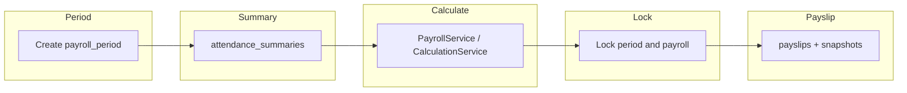

# Thiết kế mở rộng module Payroll (Laravel Production)

**Vai trò:** Senior Laravel Backend Engineer + BA + Solution Architect  
**Tham chiếu codebase:** migrations `payrolls`, `payroll_details`, `payroll_adjustments`; [`app/Services/PayrollService.php`](../app/Services/PayrollService.php) (transaction `generatePayroll`, `TAX_RATE` cố định, công chuẩn 22).

---

## 1. Tổng quan vấn đề (Restate bài toán)

Hệ thống cần **tính lương định kỳ** cho nhiều loại nhân viên (văn phòng / tài xế), theo **kỳ lương** rõ ràng, với:

- Cấu hình lương **theo thời gian** (không chỉ `positions.base_salary` tĩnh).
- **Tổng hợp công** đã khóa theo kỳ (không chỉ quét `attendances` mỗi lần tính).
- Thu nhập / khấu trừ dạng **dòng** (line items), báo cáo thuế/BHXH.
- **Tham số** BHXH/thuế có hiệu lực theo ngày.
- **Tạm ứng**, **phiếu lương** bất biến, **snapshot** và **log** tính toán.
- **Audit** người thao tác (`created_by` / `updated_by` / `deleted_by`).

Hiện tại [`PayrollService::generatePayroll`](../app/Services/PayrollService.php) đã bọc `DB::transaction` và ghi `payroll_details` tổng hợp, nhưng **chưa đủ** cho payroll production: thiếu entity kỳ chuẩn, versioning lương NV, summary công đóng băng, bảng dòng thu/chi, bảng rates, payslip/snapshot có schema, và audit field trên bảng payroll.

---

## 2. Thiếu sót schema hiện tại

| Hạng mục | Hiện trạng | Hệ quả |
|----------|------------|--------|
| Kỳ lương | `payrolls(company_id, month, year)` | Thiếu `pay_date`, `cutoff`, `period_type`, timezone; khó mở rộng kỳ 2 tuần. |
| Cấu hình lương NV | `positions.base_salary` + pivot allowance/deduction | Không có **effective_from/to**; khó tính đúng kỳ giao tháng. |
| Tổng hợp công | `attendances` theo ngày | Không có bảng **summary đã duyệt/khóa** theo kỳ. |
| Thu / chi | Cột cố định trên `payroll_details` + `payroll_adjustments` | Không line-level; `meta_json` không thay thế quan hệ. |
| Thuế/BHXH | `TAX_RATE = 0.1` trong code | Đổi chính sách = deploy code. |
| Tạm ứng / Payslip | Không có | Không trừ tạm ứng có kiểm soát; không artifact lương đã phát hành. |
| Snapshot / Log | `meta_json` | Không đủ cho kiểm toán và dispute. |
| Audit user | Không trên `payrolls`/`payroll_details` | Không biết ai tạo/sửa/khóa. |

---

## 3. Bảng mới cần thêm (tối thiểu)

| Bảng | Vai trò |
|-------|---------|
| `payroll_periods` | Định nghĩa kỳ lương chuẩn. |
| `employee_salary_configs` | Lịch sử cấu hình lương NV. |
| `attendance_summaries` | Công tổng hợp theo NV + kỳ. |
| `payroll_earnings` | Dòng thu nhập. |
| `payroll_deductions` | Dòng khấu trừ. |
| `salary_formula_sets` / `salary_formula_items` | Bộ công thức/version. |
| `insurance_rates` | Tỷ lệ/trần BHXH… theo hiệu lực. |
| `tax_brackets` | Bậc thuế lũy tiến. |
| `salary_advances` | Tạm ứng. |
| `payslips` | Phiếu lương đã phát hành. |
| `payroll_calculation_logs` | Trace tính toán. |
| `payroll_detail_snapshots` | Đóng băng input/output. |

**Gợi thêm:** `payroll_runs`, master `earning_types` / `deduction_types`.

---

## 4. Bảng cũ cần sửa

- **`employees`:** (tùy) `pay_frequency`, `currency`; audit columns nếu thống nhất toàn hệ thống.
- **`departments`:** (tùy) `cost_center_code` nếu phân bổ chi phí.
- **`attendances`:** (tùy) `approved_at` / `approved_by` trước khi đưa vào summary.
- **`payrolls`:** FK `payroll_period_id` (nullable giai đoạn chuyển đổi), workflow timestamps, audit columns — **Phase 1 đã thêm một phần** (xem migrations).
- **`payroll_details`:** audit columns — **Phase 1**; sau này: FK `payslip_id`, tổng phụ `gross_amount`, …
- **`payroll_adjustments`:** gắn `created_by` hoặc gộp vào line items có `source = manual`.

---

## 5. Thiết kế chi tiết từng bảng mới

> Quy ước: `snake_case`, `decimal(15,2)` cho tiền, `foreignId()->constrained()`, `timestamps`, `softDeletes` khi cần, `created_by`/`updated_by`/`deleted_by` → `users.id` nullable `nullOnDelete`.

### 5.1 `payroll_periods`

**Purpose:** Một kỳ lương trong phạm vi công ty.

| Cột | Kiểu | PK/FK/Unique/Index |
|-----|------|---------------------|
| `id` | bigint PK | PK |
| `company_id` | FK → companies | IX |
| `code` | string(50) | UNIQUE(company_id, code) |
| `period_type` | string(20) | monthly, biweekly, weekly, adhoc |
| `start_date`, `end_date` | date | IX |
| `cutoff_date`, `pay_date` | date nullable | |
| `status` | string(20) | draft, open, closed, locked |
| `timezone` | string(64) default UTC | |
| `created_by`, `updated_by`, `deleted_by` | FK users nullable | audit |
| `timestamps`, `deleted_at` | | soft delete |

**Business rules:** Kỳ `locked` không cho sửa summary / chạy lại calculate (enforce ở service).

### 5.2 `employee_salary_configs`

**Purpose:** Lịch sử lương theo NV.

| Cột | Kiểu | Ràng buộc |
|-----|------|-----------|
| `id` | PK | |
| `employee_id` | FK employees CASCADE | IX |
| `effective_from`, `effective_to` | date | `effective_to` nullable |
| `base_salary` | decimal(15,2) | |
| `currency` | char(3) default VND | |
| `pay_frequency` | string(20) nullable | |
| `notes` | text nullable | |
| audit + soft delete | | |

**Unique:** `(payroll_period_id, employee_id)` không áp dụng ở đây — overlap range xử lý ở service.

### 5.3 `attendance_summaries`

**Purpose:** Input công đã đóng băng cho kỳ.

| Cột | Kiểu | Ràng buộc |
|-----|------|-----------|
| `id` | PK | |
| `payroll_period_id` | FK payroll_periods CASCADE | IX |
| `employee_id` | FK employees CASCADE | IX |
| `working_days` | decimal(5,2) | |
| `actual_days`, `leave_paid_days`, `leave_unpaid_days` | decimal | defaults |
| `overtime_hours` | decimal(8,2) | |
| `status` | string(20) | draft, submitted, approved, locked |
| `approved_at` | timestamp nullable | |
| `approved_by` | FK users nullable | |
| `source` | string(20) | imported, computed, manual |
| `meta_json` | json nullable | |
| audit + soft delete | | |

**Unique:** `(payroll_period_id, employee_id)`.

### 5.4 `payroll_earnings` / 5.5 `payroll_deductions`

**Purpose:** Dòng tiền chi tiết; FK `payroll_detail_id`; `amount`, `type_code`, `taxable`/`insurable`, `source`, `meta_json`, audit, soft delete.

### 5.6 `salary_formula_sets` / 5.7 `salary_formula_items`

**Purpose:** Version công thức; items có `sequence`, `code`, `target` (earning/deduction/variable), `formula_expression` hoặc `formula_config` json.

### 5.8 `insurance_rates` / 5.9 `tax_brackets`

**Purpose:** Tham số theo `effective_from` / `effective_to`; rates decimal; `salary_cap_amount` cho trần BHXH.

### 5.10 `salary_advances`

**Purpose:** `employee_id`, `amount`, `remaining_amount`, `status`, `issued_at`, audit.

### 5.11 `payslips`

**Purpose:** `payroll_period_id`, `employee_id`, `payroll_detail_id`, `issue_number`, `issued_at`, `status` (draft/issued/void); không soft delete sau issued — chỉ void.

### 5.12 `payroll_calculation_logs`

**Purpose:** `payroll_id`, `payroll_period_id`, `employee_id` nullable, `level`, `step_code`, `message`, `context_json`, `created_at`.

### 5.13 `payroll_detail_snapshots`

**Purpose:** `payroll_detail_id`, `snapshot_version`, `schema_version`, `payload_json`, `captured_at`, `captured_by`.

**Snapshot strategy:** Lưu input lúc calculate + output lúc lock/issue payslip.

---

## 6. Luồng nghiệp vụ payroll end-to-end



1. Tạo mở `payroll_period` → tổng hợp / import `attendance_summaries` → approve/lock summary.  
2. Tạo `payroll` gắn `payroll_period_id` (và vẫn có thể giữ month/year trong giai đoạn chuyển đổi).  
3. **Calculate** trong `DB::transaction`: resolve config, summary, rates; ghi lines; cập nhật detail; log + snapshot input.  
4. **Approve / Lock** → issue **payslips** + snapshot output.  
5. **Paid** (kế toán).

---

## 7. Migration Laravel đề xuất

- **Phase 1 (đã implement trong repo):** `payroll_periods`, `employee_salary_configs`, `attendance_summaries`; bổ sung cột `payrolls` (FK period + workflow + audit); bổ sung audit `payroll_details`.
- **Phase 2:** `payroll_earnings`, `payroll_deductions`, `insurance_rates`, `tax_brackets`.
- **Phase 3:** `salary_formula_sets`, `salary_formula_items`, `salary_advances`.
- **Phase 4:** `payslips`, `payroll_detail_snapshots`, `payroll_calculation_logs` (+ `payroll_runs`).

Mỗi file: `up()` / `down()` đầy đủ, `dropForeign` trước khi `dropIfExists`.

---

## 8. Model / relation

- `PayrollPeriod` `belongsTo` Company; `hasMany` Payroll, AttendanceSummary.  
- `EmployeeSalaryConfig` `belongsTo` Employee.  
- `AttendanceSummary` `belongsTo` PayrollPeriod, Employee.  
- `Payroll` `belongsTo` Company, `belongsTo` PayrollPeriod (optional); `hasMany` PayrollDetail.  
- `PayrollDetail` `belongsTo` Payroll, Employee; `belongsTo` User cho audit FKs.

---

## 9. Service / Controller / Request / Resource

| Layer | Trách nhiệm |
|-------|-------------|
| FormRequest | Validate period, overlap config, lock state, amounts ≥ 0. |
| API Resource | Trả payslip + lines; ẩn field nội bộ. |
| Service | `PayrollCalculationService`, `PayrollPeriodService`, … — **mọi calculate/lock trong transaction**. |
| Controller | Mỏng: authorize, validate, delegate. |
| Jobs | Batch calculate queue cho công ty lớn. |

[`PayrollService`](../app/Services/PayrollService.php) có thể dần refactor gọi các service mới sau khi Phase 2+ có bảng lines.

---

## 10. API list (đề xuất)

- **Period:** CRUD + `open` / `close` / `lock`.  
- **Salary config:** CRUD theo `employees/{id}/salary-configs`.  
- **Attendance summary:** list/generate theo period, approve, lock batch.  
- **Calculation:** `POST /payrolls/{id}/calculate`, `GET .../calculation-logs`.  
- **Advance:** CRUD + cancel.  
- **Payslip:** list, show, `issue` batch, `void`, optional PDF.

---

## 11. Test cases

- **Unit:** resolve salary config tại ngày trong kỳ; chọn rate/bracket đúng hiệu lực; advance không âm `remaining_amount`.  
- **Feature:** period → summary → calculate → lock → không cho calculate lại; payslip không đổi khi sửa master sau issued.  
- **Transaction:** exception giữa bước → rollback không partial.  
- **Policy:** non-admin không approve/lock (theo route middleware hiện tại).

---

## 12. Rủi ro và lưu ý

- **Formula DSL:** tránh `eval()` PHP; whitelist hoặc chỉ config + code engine.  
- **Performance:** index `(payroll_period_id, employee_id)`, queue chunk.  
- **Double trừ tạm ứng:** transaction + lock row `salary_advances`.  
- **SQLite vs MySQL:** test migrate cả hai.  
- **Pháp lý VN:** `insurance_rates` / `tax_brackets` chỉ là khung — cần xác thực kế toán.

---

## 13. Code mẫu (tham khảo)

### Migration skeleton — `payroll_periods`

```php
Schema::create('payroll_periods', function (Blueprint $table) {
    $table->id();
    $table->foreignId('company_id')->constrained()->cascadeOnDelete();
    $table->string('code', 50);
    $table->string('period_type', 20);
    $table->date('start_date');
    $table->date('end_date');
    $table->date('cutoff_date')->nullable();
    $table->date('pay_date')->nullable();
    $table->string('status', 20)->default('draft');
    $table->string('timezone', 64)->default('UTC');
    $table->foreignId('created_by')->nullable()->constrained('users')->nullOnDelete();
    $table->foreignId('updated_by')->nullable()->constrained('users')->nullOnDelete();
    $table->foreignId('deleted_by')->nullable()->constrained('users')->nullOnDelete();
    $table->timestamps();
    $table->softDeletes();
    $table->unique(['company_id', 'code']);
});
```

### Service — transaction

```php
DB::transaction(function () use ($payrollId) {
    // lock payroll row, assert period not locked
    // recompute details + lines
});
```

### FormRequest

```php
'start_date' => ['required', 'date'],
'end_date' => ['required', 'date', 'after_or_equal:start_date'],
```

---

## Phase 1 đã triển khai trong codebase

Các file migration:

- `database/migrations/2026_03_28_100000_create_payroll_periods_table.php`
- `database/migrations/2026_03_28_100001_create_employee_salary_configs_table.php`
- `database/migrations/2026_03_28_100002_create_attendance_summaries_table.php`
- `database/migrations/2026_03_28_100003_add_payroll_period_and_audit_to_payrolls_table.php`
- `database/migrations/2026_03_28_100004_add_audit_columns_to_payroll_details_table.php`

Model: `app/Models/PayrollPeriod.php`, `EmployeeSalaryConfig.php`, `AttendanceSummary.php`.

Bảng mới: `payroll_periods`, `employee_salary_configs`, `attendance_summaries`. Cột bổ sung trên `payrolls` và audit trên `payroll_details` như mục 7. `Payroll`, `PayrollDetail`, `Employee`, `Company` đã cập nhật quan hệ và `$fillable`.

---

*Tài liệu: `docs/PAYROLL_MODULE_EXTENSION_DESIGN.md`*
