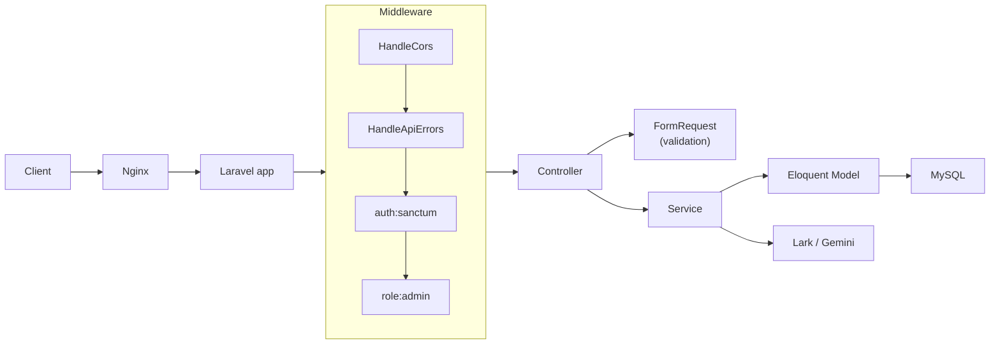
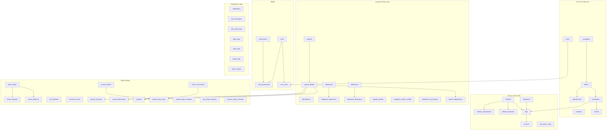

# Tổng quan chi tiết dự án ship-app-api

**Dự án:** Company Ship API -- hệ thống quản lý vận tải, nhân sự, lương, chấm công, kế toán cho doanh nghiệp vận chuyển.

**Tài liệu liên quan:**
[BACKEND_DATABASE_REPORT.md](./BACKEND_DATABASE_REPORT.md) |
[FRONTEND_API_ENDPOINTS.md](./FRONTEND_API_ENDPOINTS.md) |
[FRONTEND_PAYLOAD_BY_SCREEN.md](./FRONTEND_PAYLOAD_BY_SCREEN.md) |
[ARCHITECTURE_GUARDRAILS.md](./ARCHITECTURE_GUARDRAILS.md)

---

## 1) Tổng quan kiến trúc

### 1.1 Stack

| Layer | Cong nghe |
|-------|-----------|
| Ngon ngu | PHP 8.2+ |
| Framework | Laravel 12.x |
| Auth | Laravel Sanctum (Bearer token) |
| Database | MySQL 8.0 (Docker / production), SQLite (test/local) |
| Reverse proxy | Nginx (Docker hoac PHP-FPM production) |
| Container | Docker Compose (3 services: `app`, `db`, `nginx`) |
| AI | Google Gemini (`gemini-2.0-flash`) |
| Tich hop | Lark/Feishu (webhook, Base sync, chat notification) |
| Test | Pest / PHPUnit, architecture tests |
| Code style | Laravel Pint |

### 1.2 Architecture patterns

Du an dung **hai mo hinh** chung song:

**v1 (`app/`)** -- Service-oriented Laravel truyen thong:

```
Controller (thin) -> Service -> Model (Eloquent) -> MySQL
```

**v2 (`src/`)** -- Clean Architecture / DDD cho module Employee:

```
Interface/Http -> Application/UseCases -> Domain/Entities -> Infrastructure/Persistence
```

### 1.3 Request flow



### 1.4 Directory layout

```
ship-app-api/
|-- app/
|   |-- Console/Commands/        # Artisan commands (Lark reconcile, sync)
|   |-- Events/Lark/             # Domain events (TripCreated, PayrollApproved, DriverAssigned)
|   |-- Exceptions/              # ApiException, Handler
|   |-- Http/
|   |   |-- Controllers/Api/     # 27 API controllers (all extend BaseController)
|   |   |-- Middleware/           # HandleApiErrors, RoleMiddleware, PermissionMiddleware
|   |   |-- Requests/            # 52 FormRequests (by module subfolder)
|   |   |-- Traits/              # HasIndexQuery (list/filter/sort/search)
|   |-- Jobs/Lark/               # SendLarkMessageJob, SyncLarkBaseRecordJob
|   |-- Listeners/Lark/          # Event -> Lark notification listeners
|   |-- Models/                  # 34 Eloquent models
|   |-- Notifications/           # LateAttendanceNotification
|   |-- Providers/               # AppServiceProvider (events, v2 route registration)
|   |-- Services/                # 15 service classes (Auth, Payroll, Chat, Gemini, Lark/*)
|   |-- Traits/                  # HasAuditLogs
|-- src/                         # Clean Architecture (v2 Employee module)
|   |-- Application/Employee/    # Use cases + DTOs
|   |-- Domain/Employee/         # Entity, Value Objects, Repository interfaces, Exceptions
|   |-- Domain/Shared/           # AbstractId, Email, Phone, Money, DomainException
|   |-- Infrastructure/          # Eloquent repositories, mappers, TransactionManager
|   |-- Interface/Http/          # v2 Controllers, Requests, Resources
|-- config/                      # 16 config files (app, auth, lark, ship, ...)
|-- database/
|   |-- migrations/              # 67 migration files
|   |-- factories/               # 28 factory files
|   |-- seeders/                 # 5 seeders (Database, Roles, AllTables, SpecReference, Bulk)
|-- routes/
|   |-- api.php                  # v1 routes (public + auth + admin) + v1 prefix alias
|   |-- api_v2.php               # v2 Clean Architecture routes
|-- tests/
|   |-- Arch/                    # 2 architecture tests
|   |-- Feature/Api/             # 23 API feature tests
|   |-- Feature/Services/        # 4 service tests
|   |-- Unit/                    # Unit tests
|-- docs/                        # Project documentation (specs, DB reports, FE handoffs)
|-- docker/                      # Docker config (nginx, entrypoint)
```

### 1.5 Authentication & Authorization

- **Sanctum**: moi request authenticated gui `Authorization: Bearer <token>`.
- **RBAC**: middleware `role:admin` kiem tra user co role `admin`.
- **Roles** mac dinh: `admin`, `hr`, `manager`, `staff`.
- **Permissions**: `all`, `companies`, `offices`, `employees`, `drivers`, `vehicles`, `attendances`, `payrolls`, `trips`, `customers`, `invoices`, `reports`, v.v.
- Admin co tat ca quyen; HR co payrolls/employees/attendances; Manager co trips/vehicles/drivers.

### 1.6 Response envelope

Moi API deu tra JSON theo chuan:

**Thanh cong:**
```json
{ "success": true, "message": "OK", "data": { ... } }
```

**Loi:**
```json
{ "success": false, "message": "...", "errors": { ... } }
```

**List co phan trang (HasIndexQuery):**
```json
{
  "success": true, "message": "OK",
  "data": {
    "data": [ ... ],
    "meta": { "current_page": 1, "last_page": 5, "per_page": 15, "total": 72 }
  }
}
```

### 1.7 Exception handling

`bootstrap/app.php` map exception -> HTTP status:

| Exception | Status | Message |
|-----------|--------|---------|
| `ValidationException` | 422 | Validation failed + `errors` |
| `ModelNotFoundException` | 404 | Resource not found |
| `AuthenticationException` | 401 | Unauthenticated |
| `AuthorizationException` | 403 | Forbidden |
| `NotFoundHttpException` | 404 | Route not found |
| `MethodNotAllowedHttpException` | 405 | Method not allowed |
| `QueryException` | 500 | Database error (detail if `APP_DEBUG`) |
| `ApiException` (custom) | dynamic | Custom status + errors |
| Other `Throwable` | 500 | Internal error (trace if `APP_DEBUG`) |

---

## 2) Cac chuc nang (7 module nghiep vu)

### 2.1 Auth & User

| Chuc nang | Controller | Service |
|-----------|-----------|---------|
| Login / Logout / Refresh token | `AuthController` | `AuthService` |
| Register (admin only) | `AuthController` | `AuthService` |
| Test accounts (dev/staging) | `AuthController` | -- |
| RBAC: Roles CRUD + sync permissions | `RoleController` | -- |
| Permissions list | `PermissionController` | -- |
| Users CRUD | `UserController` | -- |

**Models:** `User`, `Role`, `Permission`, `RefreshToken`
**Pivot:** `user_roles`, `role_permissions`

### 2.2 To chuc & nhan su

| Chuc nang | Controller | Models |
|-----------|-----------|--------|
| Cong ty | `CompanyController` | `Company` |
| Van phong | `OfficeController` | `Office` |
| Phong ban | `DepartmentController` | `Department` |
| Chuc danh | `PositionController` | `Position` |
| Nhan vien (CRUD + ho so day du) | `EmployeeController` | `Employee` |
| Tai xe (CRUD + GPLX + BH) | `DriverController` | `Driver` |
| v2 Employee (Clean Architecture) | `src/.../EmployeeController` | `EmployeeModel` (src) |

**Ho so mo rong:** avatar, CCCD, BHXH, BHYT, ngan hang, lien he khan cap, dia chi.

### 2.3 Doi xe & van hanh

| Chuc nang | Controller | Models |
|-----------|-----------|--------|
| Xe | `VehicleController` | `Vehicle` |
| Phan cong xe | `VehicleAssignmentController` | `VehicleAssignment` |
| Chi phi xe | `VehicleExpenseController` | `VehicleExpense` |
| Khach hang | `CustomerController` | `Customer` |
| Chuyen xe (workflow status) | `TripController` | `Trip` |
| Quy tac thuong chuyen | `TripBonusRuleController` | `TripBonusRule` |
| Hoa don | `InvoiceController` | `Invoice` |

**Trip workflow:** `pending` -> `in_progress` -> `completed` | `cancelled`
**Invoice status:** `draft` -> `issued` -> `paid` | `cancelled`

### 2.4 Cham cong & luong

| Chuc nang | Controller | Service | Models |
|-----------|-----------|---------|--------|
| Cham cong CRUD | `AttendanceController` | -- | `Attendance` |
| Canh bao di muon | `AttendanceController` | `AttendanceLateNotificationService` | -- |
| Phu cap / Khau tru master | `AllowanceController` / `DeductionController` | -- | `Allowance`, `Deduction` |
| Bang luong (generate + workflow) | `PayrollController` | `PayrollService`, `PayrollWorkflowService`, `PayrollQueryService` | `Payroll`, `PayrollDetail`, `PayrollAdjustment` |
| Xem luong ca nhan | `PayrollController@mySalary` | `PayrollQueryService` | -- |
| Export luong | `PayrollController@export` | `PayrollQueryService` | -- |

**Payroll workflow:** `draft` -> `approved` -> `locked` (khong cho sua/xoa khi locked)
**Payroll phase 1 (schema co, logic co):** `PayrollPeriod`, `EmployeeSalaryConfig`, `AttendanceSummary`

### 2.5 MUST HAVE (schema da co -- API wiring tach phase)

| Module | Tables | Trang thai |
|--------|--------|------------|
| Nghi phep | `leave_types`, `leave_requests`, `leave_balances` | Schema + seed, chua co route |
| Thue / Bao hiem | `tax_brackets`, `insurance_rates` | Schema + seed, chua co route |
| Dong luong chi tiet | `payroll_earnings`, `payroll_deductions` | Schema + seed, chua co route |
| Phieu luong | `payslips` | Schema + seed, chua co route |
| Ke toan toi thieu | `chart_of_accounts`, `journal_entries`, `journal_entry_lines` | Schema + seed, chua co route |
| Lich su trang thai | `payroll_status_histories`, `trip_status_histories`, `invoice_status_histories` | Schema + seed, chua co route |

### 2.6 Bao cao

| Chuc nang | Controller | Service |
|-----------|-----------|---------|
| Dashboard tong hop | `ReportsController@dashboard` | `ReportService` |
| Bao cao tong hop luong | `ReportsController@payrollSummary` | `ReportService` |

### 2.7 Ung dung & tich hop

| Chuc nang | Controller / Service | Mo ta |
|-----------|---------------------|-------|
| Chat AI | `ChatController`, `ChatService`, `GeminiService` | Chat/stream voi Gemini; luu `chat_messages` |
| AI tu van kinh doanh | `AiAdvisorController`, `BusinessAiAdvisorService` | Phan tich du lieu + goi y |
| Lark webhook | `LarkWebhookController`, `LarkSignatureService` | Nhan event tu Lark, xac thuc signature, log |
| Lark Base sync | `LarkBaseSyncService`, `SyncLarkBaseRecordJob` | Dong bo NV/chuyen xe len Lark Base |
| Lark notification | `LarkNotificationService`, listeners | Gui thong bao khi tao trip, duyet luong, phan tai xe |
| Lark command router | `LarkCommandRouterService` | Xu ly lenh chat tu Lark |

---

## 3) API

### 3.1 Public (khong can token)

| Method | Path | Mo ta |
|--------|------|-------|
| GET | `/api/health` | Health check |
| POST | `/api/auth/login` | Dang nhap, tra token |
| GET | `/api/auth/test-accounts` | Danh sach tai khoan demo (chi local/testing) |
| POST | `/api/lark/webhook` | Lark event webhook |

### 3.2 Authenticated (`auth:sanctum`)

| Method | Path | Mo ta |
|--------|------|-------|
| GET | `/api/user` hoac `/api/auth/me` | Thong tin user dang nhap |
| POST | `/api/auth/logout` | Dang xuat |
| POST | `/api/auth/refresh` | Lam moi token |
| GET | `/api/payrolls/my-salary` | Xem luong ca nhan |
| GET | `/api/chat/sessions` | Danh sach session chat |
| DELETE | `/api/chat/sessions/{id}` | Xoa session chat |
| GET | `/api/chat/messages` | Lich su chat theo session |
| POST | `/api/chat/messages` | Gui tin nhan chat AI |
| POST | `/api/chat/messages/stream` | Stream chat AI (SSE) |

### 3.3 Admin (`auth:sanctum` + `role:admin`)

#### apiResource CRUD (moi resource co 5 routes: index, store, show, update, destroy)

| Resource | Searchable | Filterable | Sort columns |
|----------|-----------|-----------|--------------|
| `companies` | `code`, `name` | `status` | `id`, `code`, `name`, `status`, `created_at` |
| `offices` | `code`, `name` | `company_id` | `id`, `code`, `name`, `company_id`, `created_at` |
| `departments` | `code`, `name` | `office_id` | `id`, `code`, `name`, `office_id`, `created_at` |
| `positions` | `code`, `name` | -- | `id`, `code`, `name`, `base_salary`, `level`, `created_at` |
| `employees` | `code`, `name`, `email` | `office_id`, `department_id`, `type`, `status` | `id`, `code`, `name`, `email`, `type`, `status`, `office_id`, `join_date`, `created_at` |
| `drivers` | `license_no` + employee `name`/`code` | `employee_id`, `available_status` | `id`, `employee_id`, `license_no`, `available_status`, `expired_date`, `created_at` |
| `vehicles` | `plate_number`, `brand`, `model` | `office_id`, `status` | `id`, `plate_number`, `type`, `status`, `office_id`, `year`, `created_at` |
| `vehicle_assignments` | -- | `vehicle_id`, `driver_id` | `id`, `vehicle_id`, `driver_id`, `from_date`, `to_date`, `created_at` |
| `vehicle_expenses` | -- | `vehicle_id`, `driver_id`, `type` | `id`, `vehicle_id`, `driver_id`, `type`, `amount`, `expense_date`, `created_at` |
| `customers` | `name`, `tax_code`, `email` | `type` | `id`, `name`, `type`, `tax_code`, `created_at` |
| `trips` | `code`, `start_point`, `end_point` | `customer_id`, `driver_id`, `vehicle_id`, `status`, `company_id`*, `office_id`* | `id`, `code`, `customer_id`, `driver_id`, `vehicle_id`, `status`, `start_time`, `price`, `created_at` |
| `trip_bonus_rules` | -- | -- | `id`, `min_km`, `max_km`, `bonus_per_km`, `created_at` |
| `invoices` | `code` | `trip_id`, `customer_id`, `status` | `id`, `code`, `customer_id`, `trip_id`, `status`, `total_amount`, `issued_at`, `created_at` |
| `allowances` | `code`, `name` | -- | `id`, `code`, `name`, `default_amount`, `created_at` |
| `deductions` | `code`, `name` | -- | `id`, `code`, `name`, `created_at` |
| `attendances` | -- | `employee_id`, `status` | `id`, `employee_id`, `date`, `status`, `created_at` |
| `payrolls` | -- | `company_id`, `month`, `year`, `status` | `id`, `company_id`, `month`, `year`, `status`, `locked_at`, `created_at` |
| `users` | `username`, `email` | `status` | `id`, `username`, `email`, `status`, `created_at` |
| `roles` | `name` | -- | `id`, `name`, `created_at` |

(*) `company_id` va `office_id` tren `trips` filter qua relation `vehicle.office`.

**Query chung cho moi list:** `page`, `per_page` (1-100, default 15), `sort_by`, `sort_order` (`asc`/`desc`), `keyword` / `q` / `search`.

#### Custom admin routes

| Method | Path | Mo ta |
|--------|------|-------|
| POST | `/api/payrolls/{id}/approve` | Duyet bang luong |
| POST | `/api/payrolls/{id}/lock` | Khoa bang luong |
| GET | `/api/payrolls/{id}/export` | Export bang luong (JSON) |
| POST | `/api/roles/{role}/permissions` | Sync permissions cho role |
| GET | `/api/permissions` | Danh sach permissions |
| GET | `/api/permissions/{id}` | Chi tiet permission |
| GET | `/api/attendances/late/list` | Danh sach di muon |
| POST | `/api/attendances/late/notify` | Gui thong bao di muon |
| GET | `/api/reports/dashboard` | Bao cao dashboard |
| GET | `/api/reports/payroll-summary` | Bao cao tong hop luong |
| POST | `/api/ai/business-assist` | Tu van AI kinh doanh |
| POST | `/api/auth/register` | Dang ky user moi |

### 3.4 v2 Clean Architecture (`auth:sanctum` + `role:admin` + `throttle:60,1`)

| Method | Path | Mo ta |
|--------|------|-------|
| GET | `/api/v2/employees` | Danh sach nhan vien (Clean Arch) |
| POST | `/api/v2/employees` | Tao nhan vien |
| GET | `/api/v2/employees/{id}` | Chi tiet nhan vien |
| PUT | `/api/v2/employees/{id}` | Cap nhat nhan vien |
| DELETE | `/api/v2/employees/{id}` | Xoa nhan vien |

### 3.5 Versioned alias

Tat ca route o muc 3.1-3.3 cung co alias tai `/api/v1/...` (cung controller, cung middleware). Vi du: `POST /api/v1/auth/login`, `GET /api/v1/companies`, v.v.

---

## 4) Database

### 4.1 Tong quan

- **67 migration files**, tao khoang **45+ tables**.
- Engine: **MySQL 8.0** (production/Docker) + **SQLite** (test).
- ORM: **Eloquent** voi **34 models**.

### 4.2 Nhom bang theo nghiep vu



#### Nhom 1: To chuc & nhan su (7 bang)
`companies`, `offices`, `departments`, `positions`, `employees`, `drivers`, `users`

#### Nhom 2: RBAC (4 bang + 2 pivot)
`roles`, `permissions`, `user_roles`, `role_permissions`, `personal_access_tokens`, `refresh_tokens`

#### Nhom 3: Doi xe & van hanh (7 bang)
`vehicles`, `vehicle_assignments`, `vehicle_expenses`, `customers`, `trips`, `trip_bonus_rules`, `invoices`

#### Nhom 4: Cham cong & luong (11 bang)
`attendances`, `allowances`, `deductions`, `employee_allowances`, `employee_deductions`, `payrolls`, `payroll_details`, `payroll_adjustments`, `payroll_periods`, `employee_salary_configs`, `attendance_summaries`

#### Nhom 5: MUST HAVE -- schema moi (15 bang)
`leave_types`, `leave_requests`, `leave_balances`, `tax_brackets`, `insurance_rates`, `payroll_earnings`, `payroll_deductions`, `payslips`, `chart_of_accounts`, `journal_entries`, `journal_entry_lines`, `payroll_status_histories`, `trip_status_histories`, `invoice_status_histories`

#### Nhom 6: Ung dung, logs, infra (10+ bang)
`notifications`, `chat_messages`, `lark_event_logs`, `login_logs`, `audit_logs`, `export_logs`, `report_caches`, `cache`, `jobs`, `sessions`, `password_reset_tokens`

### 4.3 Quy tac schema

| Quy tac | Chi tiet |
|---------|---------|
| Ten bang | `snake_case`, so nhieu |
| Ten cot | `snake_case` |
| Tien te | `decimal(15,2)` |
| Soft delete | `softDeletes()` tren bang nghiep vu |
| Audit | `created_by`, `updated_by`, `deleted_by` FK -> `users`, nullable, `nullOnDelete` |
| Timestamps | `created_at`, `updated_at` (Laravel mac dinh) |
| FK pattern | Neu bang chua ton tai khi tao -> dung `unsignedBigInteger` + migration tach `add_*_foreign_key.php` |
| Index | Composite index cho cac cot filter/join nang (`2026_04_15_104000_add_critical_indexes_for_scale`) |

### 4.4 Seeders

| Seeder | Chuc nang |
|--------|-----------|
| `DatabaseSeeder` | Entry point: tao demo data (company, offices, employees, users, vehicles, trip rules) -> goi cac seeder con |
| `RolesAndPermissionsSeeder` | Tao roles (`admin`, `hr`, `manager`, `staff`) + permissions + gan quyen |
| `AllTablesSeeder` | Dam bao moi bang co it nhat 1 dong (dung factory) |
| `SpecReferenceDataSeeder` | Du lieu tham chieu MUST HAVE (leave types, tax brackets, insurance rates, chart of accounts, demo entries) |
| `BulkDataSeeder` | Stress test: 100+ dong moi bang (tuy chon, mac dinh tat) |

### 4.5 Factories

**28 factory files** tuong ung voi cac model chinh. Moi factory su dung `fake()` de tao du lieu ngau nhien phu hop kieu cot.

---

## 5) Cac rules & conventions

### 5.1 Cursor Rule (`.cursor/rules/laravel-senior.mdc`)

| # | Rule | Mo ta |
|---|------|-------|
| 1 | Reconnaissance First | Xem code ton tai truoc khi sua; khong gia dinh schema/route |
| 2 | Layering | Controller thin -> Service -> Model; khong dat logic trong controller |
| 3 | Input/Output Contract | FormRequest cho validation; chi dung `validated()`; khong `request()->all()` |
| 4 | Type Safety | `declare(strict_types=1)` moi file PHP; parameter + return types |
| 5 | Security | Middleware theo intent: public (health/login), auth (`auth:sanctum`), admin (`role:admin`) |
| 6 | Database & Performance | Eager loading chong N+1; index cho cot filter; transaction cho multi-write |
| 7 | Payroll Guardrails | Tuan thu state flow `draft -> approved -> locked`; reject mutation khi locked; log key decisions |
| 8 | Testing | Feature tests cho endpoint + authorization; Unit tests cho service; giu arch tests pass |

### 5.2 Architecture Guardrails (`docs/ARCHITECTURE_GUARDRAILS.md`)

1. **Controller mong:** chi nhan request, goi service, tra response.
2. **Validation tach rieng:** FormRequest bat buoc, cam inline `$request->validate()`.
3. **Service theo trach nhiem:**
   - `AuthService`: login/register/logout/refresh
   - `ReportService`: dashboard/payroll summary
   - `PayrollService`: generate + tinh toan
   - `PayrollWorkflowService`: update/approve/lock/delete + state guard
   - `PayrollQueryService`: export + my-salary
4. **Payroll workflow chuan:** `draft -> approved -> locked`, chan transition sai.
5. **Kiem thu kien truc bat buoc:** 2 file arch test.

### 5.3 Architecture Tests (tu dong chay trong CI)

**Test 1 -- `ApiControllersArchitectureTest.php`:**
- Moi controller trong `App\Http\Controllers\Api` phai `extends BaseController`.
- Moi controller phai dung `strict_types`.

**Test 2 -- `ApiControllersValidationArchitectureTest.php`:**
- Cam `$request->validate(` va `Validator::make(` trong API controllers.
- Buoc dung FormRequest.

### 5.4 Convention tom tat

| Convention | Ap dung |
|------------|---------|
| `declare(strict_types=1)` | Tat ca PHP file |
| FormRequest | Moi endpoint co input |
| `validated()` only | Khong dung `$request->all()` |
| Eager loading | `with()` khi tra relation data |
| Transaction | `DB::transaction()` cho multi-step writes |
| Naming | Controller: `{Resource}Controller`; Request: `Store{Resource}Request` / `Update{Resource}Request` |
| Response | Luon qua `successResponse()` / `errorResponse()` cua `BaseController` |
| Sort whitelist | `$allowedSortColumns` trong moi controller dung `HasIndexQuery` |
| Test truoc merge | `php artisan test` phai pass (bao gom arch tests) |
| Migration `down()` | Drop FK/index truoc khi drop column/table |
| Code style | `./vendor/bin/pint` (Laravel Pint) |

### 5.5 Config keys (ship.php + lark.php)

#### `config/ship.php`
| Key | Muc dich | Default |
|-----|----------|---------|
| `api_uri_prefix` | API prefix | `api` |
| `attendance.late_after` | Giờ tính đi muộn | `08:15` |
| `expose_test_accounts` | Bat test-accounts route | `false` |
| `bulk_seed_count` | So dong BulkDataSeeder | `100` |

#### `config/lark.php`
| Key | Muc dich |
|-----|----------|
| `app_id` / `app_secret` | Lark app credentials |
| `verification_token` / `encrypt_key` / `signing_secret` | Webhook security |
| `base.app_token` / `base.*_table_id` | Lark Base (spreadsheet) sync |
| `base.enable_reverse_sync` | Dong bo nguoc tu Lark Base |
| `chat_ids.ops` / `hr` / `fleet` / `payroll` | Group chat IDs de gui thong bao |
| `security.max_request_age_seconds` | Max age webhook request (300s) |

---

## Phu luc: Lenh phat trien thuong dung

```bash
# Khoi dong Docker
docker compose up -d --build

# Chay migration (trong container hoac host)
php artisan migrate
php artisan migrate:fresh --seed

# Chay test
php artisan test
php artisan test --testsuite=Arch

# Code style
./vendor/bin/pint

# Seed du lieu lon
BULK_SEED_COUNT=500 php artisan db:seed --class=BulkDataSeeder

# Route list
php artisan route:list --json
```
