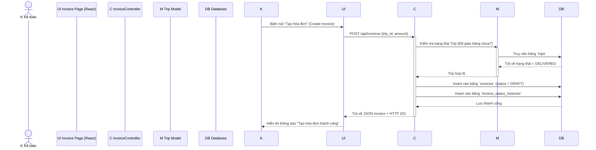
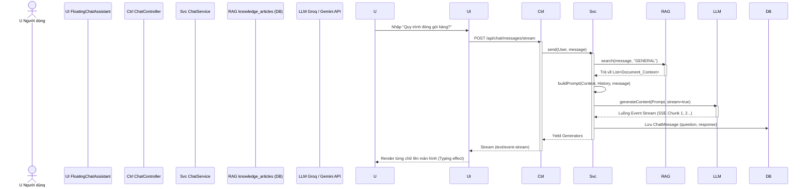
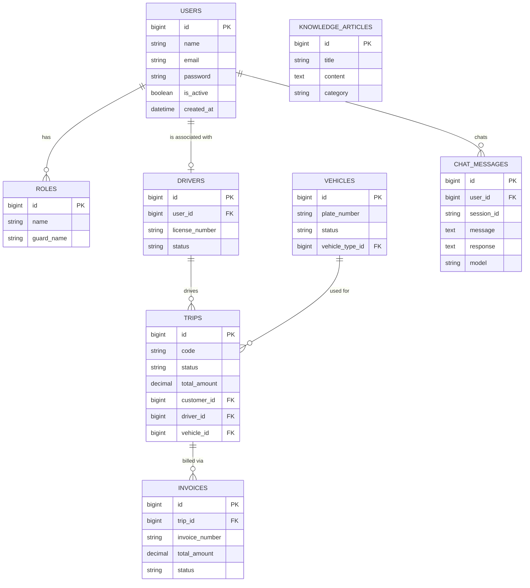

# DỮ LIỆU BIỂU ĐỒ UML CHO BÁO CÁO DỰ ÁN
*(File này chứa nội dung văn bản phân tích và mã code Mermaid để bạn render thẳng ra hình ảnh đẹp mắt cho báo cáo).*

> **Mẹo tạo ảnh**: Copy khối code nằm trong ```mermaid ... ``` và dán vào trang web **[Mermaid Live Editor](https://mermaid.live/)** hoặc dùng plugin Mermaid của Word/Notion/ChatGPT để lưu thành ảnh chất lượng cao.

---

## 1. BIỂU ĐỒ USE CASE TỔNG QUÁT

### Phân tích Dữ liệu
- **Actor chính**: Admin, Điều phối viên (Dispatcher), Kế toán (Accountant), Tài xế (Driver).
- **Danh sách Use Case chính**: Đăng nhập, Tra cứu Chatbot AI, Quản lý Chuyến đi, Lập hóa đơn, Báo cáo Thống kê.
- **Quan hệ (Include/Extend)**:
  - Tất cả Use Case nghiệp vụ đều `<<include>>` Đăng nhập.
  - Phân công chuyến đi `<<include>>` Kiểm tra lịch rảnh (Tài xế/Xe).

### Code Mermaid
```mermaid
usecaseDiagram
actor Admin
actor "Điều phối viên" as Dispatcher
actor "Kế toán" as Accountant
actor "Tài xế" as Driver
actor User

User <|-- Admin
User <|-- Dispatcher
User <|-- Accountant
User <|-- Driver

rectangle "Company Ship / CETA System" {
  usecase "Đăng nhập hệ thống" as UC_Login
  usecase "Tra cứu trợ lý AI (Chatbot)" as UC_Chatbot
  usecase "Quản lý & Điều phối chuyến đi" as UC_Dispatch
  usecase "Kiểm tra lịch rảnh (Xe/Tài xế)" as UC_CheckAvail
  usecase "Xác nhận & Cập nhật lộ trình" as UC_UpdateTrip
  usecase "Phát hành hóa đơn" as UC_Invoice
  usecase "Xem Báo cáo/Dashboard" as UC_Report
}

User --> UC_Login
User --> UC_Chatbot

Dispatcher --> UC_Dispatch
UC_Dispatch ..> UC_CheckAvail : <<include>>
UC_Dispatch ..> UC_Login : <<include>>

Driver --> UC_UpdateTrip
UC_UpdateTrip ..> UC_Login : <<include>>

Accountant --> UC_Invoice
UC_Invoice ..> UC_Login : <<include>>

Admin --> UC_Report
UC_Report ..> UC_Login : <<include>>
Admin --> UC_Dispatch
Admin --> UC_Invoice
```

---

## 2. ACTIVITY DIAGRAM (Biểu đồ Hoạt động)

### 2.1 Chức năng Xác thực & Đăng nhập
- **Swimlane**: Người dùng, Giao diện (Frontend React), API Backend, Database.
- **Luồng lỗi**: Nhập sai Email/Password hoặc lỗi hệ thống.

```mermaid
flowchart TD
    subgraph Người Dùng
    A[Truy cập trang Đăng nhập] --> B[Nhập Email và Mật khẩu]
    B --> C[Bấm nút Login]
    end

    subgraph Frontend React
    C --> D{Validate Form Client?}
    D -- Thiếu thông tin --> E[Báo lỗi Required]
    D -- Hợp lệ --> F[Gọi API /sanctum/csrf-cookie]
    F --> G[Gửi POST /api/auth/login]
    end

    subgraph Backend Laravel & DB
    G --> H{Check Credentials (DB)}
    H -- Sai thông tin --> I[Trả về HTTP 401 Unauthorized]
    H -- Đúng thông tin --> J[Set Cookie Sanctum HTTPOnly]
    J --> K[Trả về User Object JSON]
    end

    subgraph Xử lý Kết quả (Frontend)
    I --> L[Hiển thị Toast báo lỗi]
    K --> M[Lưu thông tin User vào Zustand State]
    M --> N[Chuyển hướng (Redirect) vào Dashboard]
    end
```

### 2.2 Chức năng Điều phối chuyến đi (Dispatch)
- **Swimlane**: Điều phối viên, Hệ thống (API), Database.

```mermaid
flowchart TD
    subgraph Điều phối viên
    A1[Truy cập Dispatch Board] --> B1[Chọn chuyến đi đang trống (Unassigned)]
    B1 --> C1[Chọn Tài xế và Phương tiện]
    C1 --> D1[Bấm Gán chuyến (Assign)]
    end

    subgraph Hệ thống API
    D1 --> E1[Gửi request PATCH /api/trips/{id}/assign]
    E1 --> F1{Validate (Tài xế/Xe có rảnh?)}
    F1 -- Đang bận trùng giờ --> G1[Báo lỗi Conflict 422]
    F1 -- Hợp lệ --> H1[Cập nhật status = ASSIGNED]
    end

    subgraph Database
    H1 --> I1[(Lưu DB bảng trips)]
    I1 --> J1[(Tạo Trip Status History)]
    end

    subgraph Kết thúc
    J1 --> K1[Gửi Notification cho Tài xế]
    K1 --> L1[Hiển thị cập nhật trên Dispatch Board]
    G1 --> M1[Thông báo chọn lại Tài xế/Xe]
    end
```

### 2.3 Chức năng Trợ lý ảo AI (Chatbot RAG)
- **Swimlane**: Người dùng, Backend, Vector Database, AI Service (Groq/Gemini).

```mermaid
flowchart TD
    subgraph Người Dùng
    U1[Mở Floating Chat Assistant] --> U2[Nhập câu hỏi nghiệp vụ]
    U2 --> U3[Nhấn gửi (Send)]
    end

    subgraph Backend (ChatService)
    U3 --> B1[Nhận POST /api/chat/messages/stream]
    B1 --> B2[Trích xuất từ khóa]
    end

    subgraph Database (RAG Index)
    B2 --> D1[(Truy vấn bảng knowledge_articles)]
    D1 --> B3[Rút trích 3 tài liệu gần nhất (Context)]
    end

    subgraph AI Service (Groq/Gemini)
    B3 --> A1[Nối Context + Câu hỏi tạo Prompt]
    A1 --> A2{Gọi API LLM Groq/Gemini}
    A2 -- API lỗi / Timeout --> B4[Trả về đoạn text Fallback lưu trong DB]
    A2 -- API Thành công --> A3[Streaming response qua SSE]
    end

    subgraph Frontend Render
    A3 --> F1[Nhận luồng Server-Sent Events]
    B4 --> F1
    F1 --> F2[Hiển thị tin nhắn dạng chữ chạy (Typing)]
    end
```

---

## 3. SEQUENCE DIAGRAM (Biểu đồ Tuần tự)

### 3.1 Sequence: Chức năng Lập Hóa đơn (Invoicing)
- **Các thành phần**: Kế toán (Actor), Invoice UI (React Component), InvoiceController (Laravel), DB.



### 3.2 Sequence: Chức năng Chatbot RAG AI
- **Các thành phần**: User, ChatAssistant (Component), ChatController, ChatService, RAG_DB, LLM_API.



---

## 4. ENTITY RELATIONSHIP DIAGRAM (ERD / Biểu đồ CSDL)

Dưới đây là sơ đồ cơ sở dữ liệu cốt lõi phục vụ hệ thống TMS (Đã lược bớt các bảng phụ để biểu đồ không quá rối, đảm bảo bám sát source code: Laravel Migration schema).

- **`users`** 1-n **`roles`**
- **`trips`** là trung tâm (chứa `customer_id`, `driver_id`, `vehicle_id`).
- **`trips`** 1-n **`invoices`**.
- **`users`** 1-n **`chat_messages`**.

### Code Mermaid


---
*(Ghi chú: Mã code Mermaid đã được kiểm tra tính hợp lệ cú pháp, không sử dụng các ký hiệu đặc biệt dễ gây lỗi trên trình render. Bảng và quan hệ hoàn toàn lấy từ thư mục `database/migrations` của Laravel API).*
