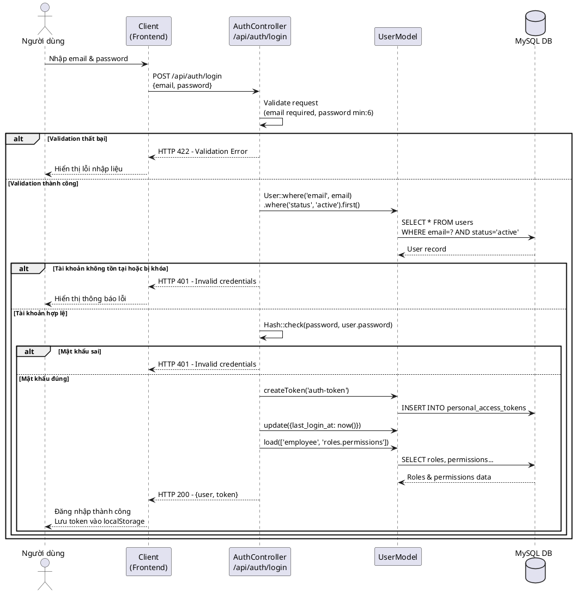
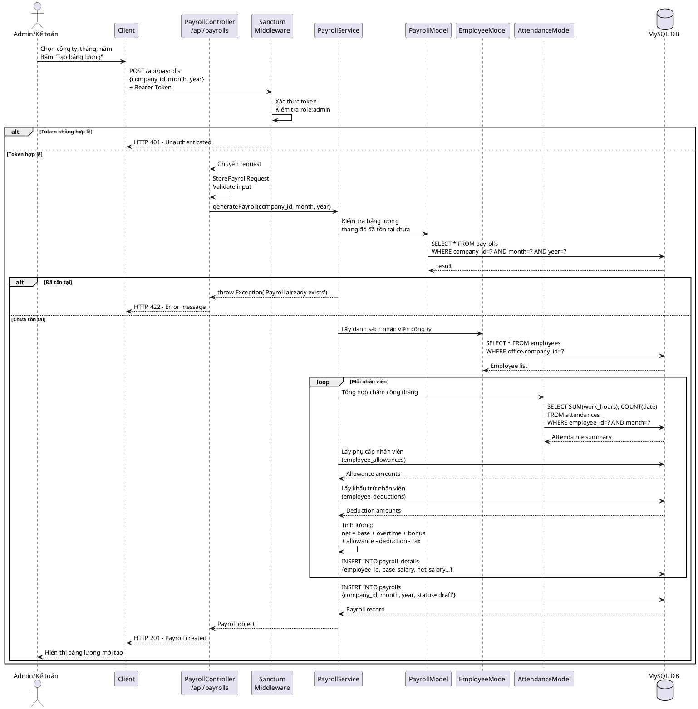
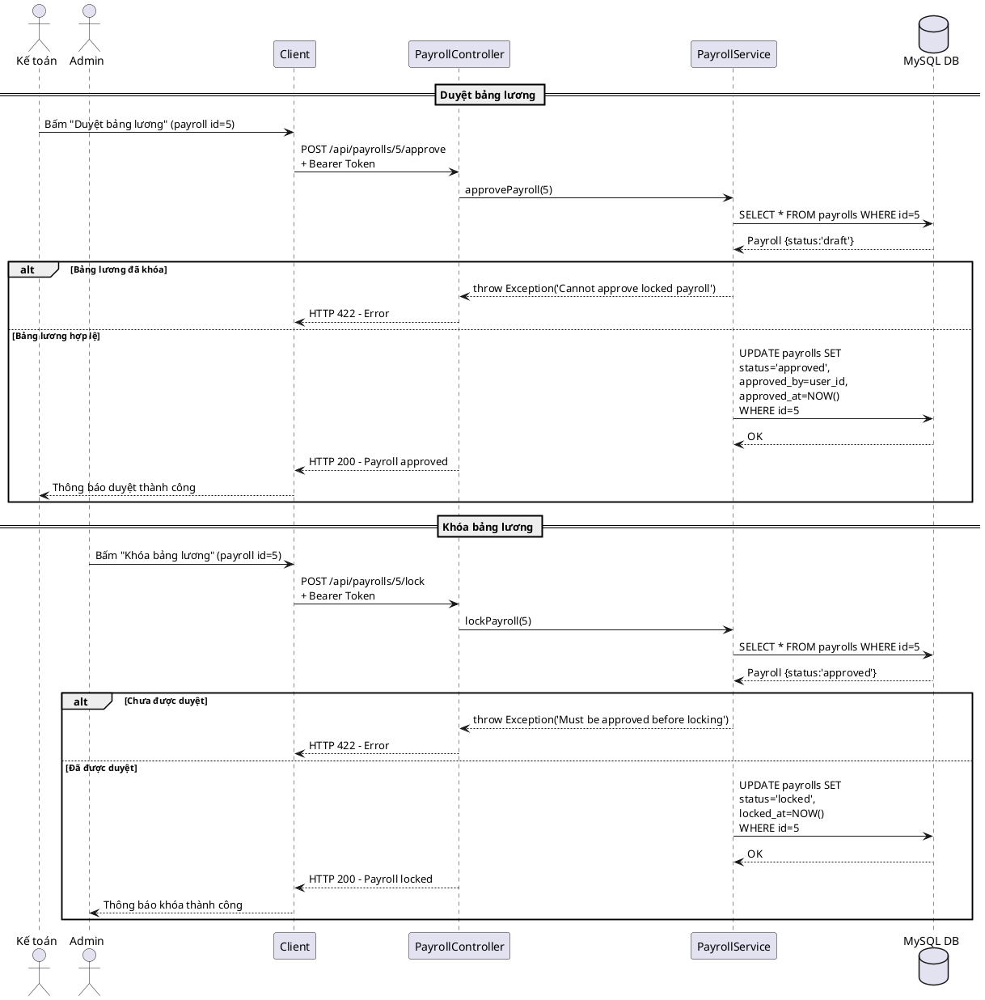
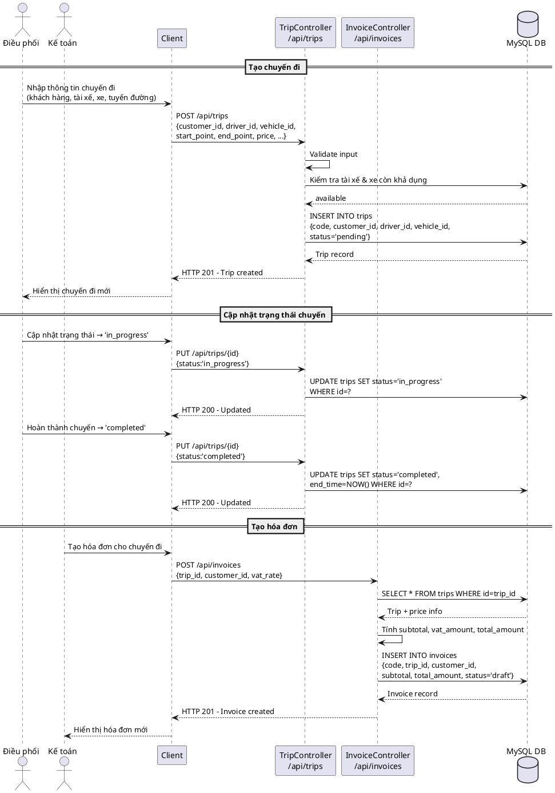
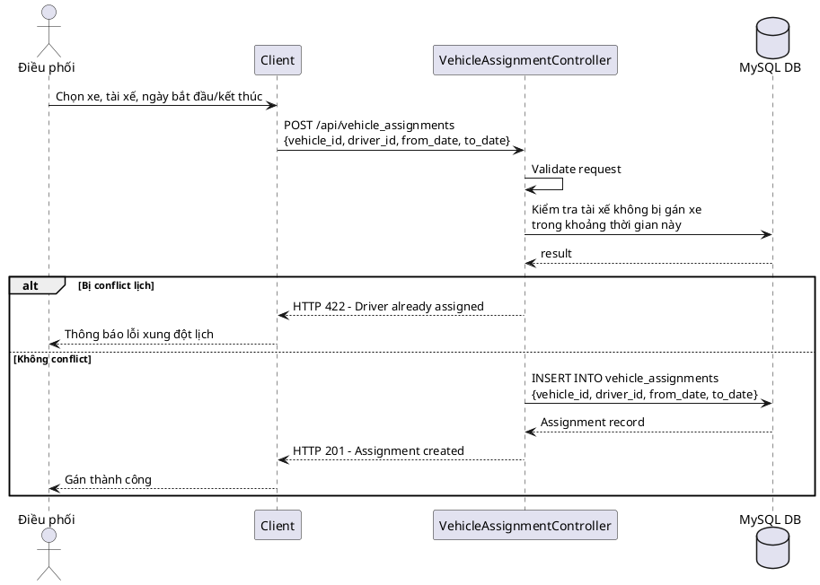
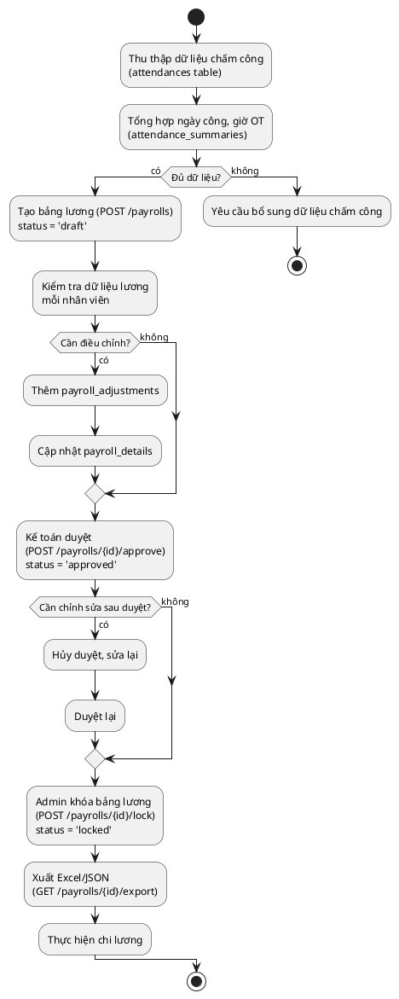
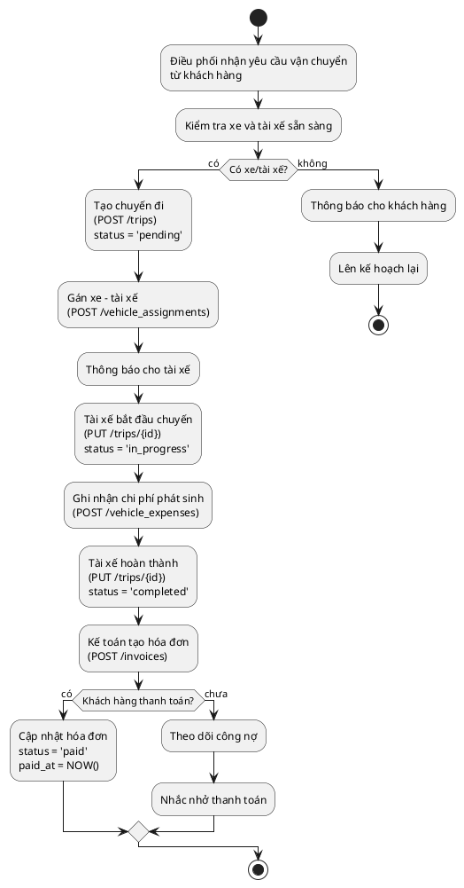
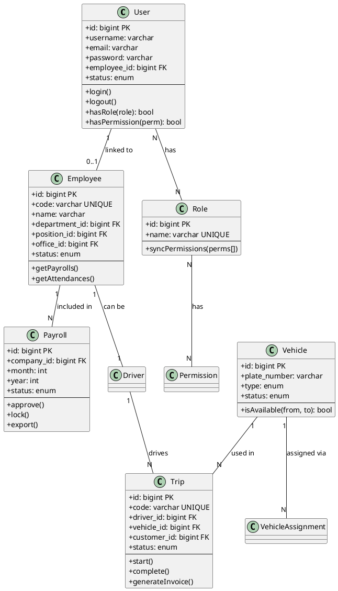

# TÀI LIỆU ĐẶC TẢ SƠ ĐỒ TUẦN TỰ & HOẠT ĐỘNG
## Hệ thống: Company Ship ERP - Quản lý vận tải & nhân sự

---

## 1. Sơ đồ tuần tự (Sequence Diagram)

### SD-01: Luồng đăng nhập hệ thống

---

### SD-02: Luồng tạo bảng lương

---

### SD-03: Luồng duyệt & khóa bảng lương

---

### SD-04: Luồng tạo chuyến đi & hóa đơn

---

### SD-05: Luồng gán xe - tài xế

---

## 2. Sơ đồ hoạt động (Activity Diagram)

### AD-01: Quy trình xử lý lương hàng tháng

### AD-02: Quy trình quản lý chuyến đi

---

## 3. Sơ đồ lớp đơn giản hóa (Simplified Class Diagram)

