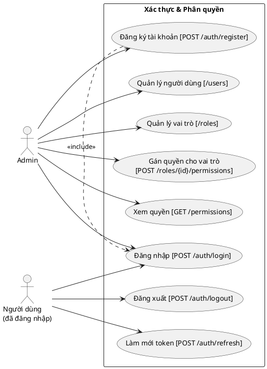
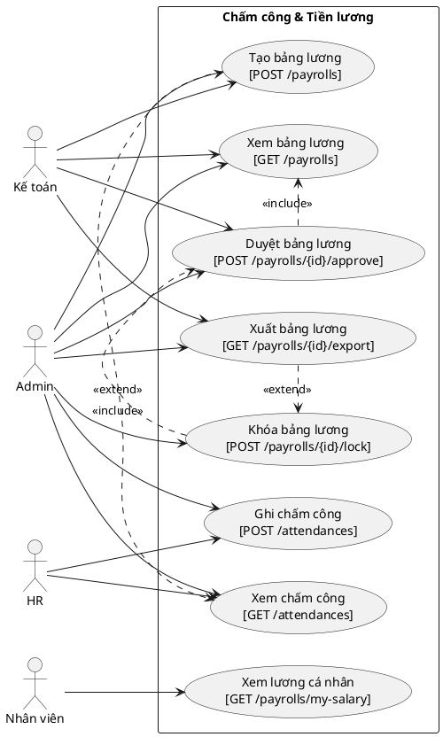
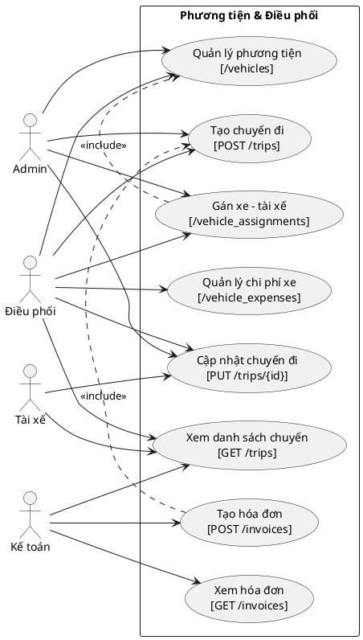

# TÀI LIỆU ĐẶC TẢ SƠ ĐỒ TRƯỜNG HỢP SỬ DỤNG (USE CASE DIAGRAM)
## Hệ thống: Company Ship ERP - Quản lý vận tải & nhân sự

---

## 1. Xác định tác nhân (Actors)

| Actor | Mô tả |
|-------|-------|
| **Quản trị viên (Admin)** | Quản lý toàn bộ hệ thống: người dùng, vai trò, công ty, phân quyền |
| **Nhân viên HR** | Quản lý thông tin nhân sự, chấm công, tính lương |
| **Nhân viên điều phối** | Quản lý chuyến đi, điều phối xe và tài xế |
| **Kế toán** | Xem, duyệt, xuất bảng lương; quản lý hóa đơn |
| **Tài xế (Driver)** | Nhân viên lái xe, được gán vào chuyến đi |
| **Nhân viên thường** | Xem thông tin lương cá nhân |

---

## 2. Danh sách Use Case theo phân hệ

### 2.1. Phân hệ Xác thực (Authentication)

| UC ID | Tên Use Case | Actor chính | Mô tả |
|-------|-------------|-------------|-------|
| UC-01 | Đăng nhập hệ thống | Tất cả | Xác thực email/mật khẩu, nhận token Bearer |
| UC-02 | Đăng xuất hệ thống | Tất cả (đã đăng nhập) | Thu hồi token hiện tại |
| UC-03 | Làm mới token | Tất cả (đã đăng nhập) | Cấp token mới, hủy token cũ |
| UC-04 | Đăng ký tài khoản | Admin | Tạo tài khoản người dùng mới |

### 2.2. Phân hệ Quản lý người dùng & phân quyền

| UC ID | Tên Use Case | Actor chính | Mô tả |
|-------|-------------|-------------|-------|
| UC-05 | Xem danh sách người dùng | Admin | Danh sách tài khoản trong hệ thống |
| UC-06 | Tạo người dùng | Admin | Tạo tài khoản mới |
| UC-07 | Cập nhật người dùng | Admin | Sửa thông tin, gán nhân viên |
| UC-08 | Xóa người dùng | Admin | Xóa mềm tài khoản |
| UC-09 | Quản lý vai trò (Role) | Admin | CRUD vai trò |
| UC-10 | Gán quyền cho vai trò | Admin | Sync danh sách permission vào role |
| UC-11 | Xem danh sách quyền | Admin | Liệt kê toàn bộ permissions |

### 2.3. Phân hệ Tổ chức & Danh mục

| UC ID | Tên Use Case | Actor chính | Mô tả |
|-------|-------------|-------------|-------|
| UC-12 | Quản lý công ty | Admin | CRUD thông tin công ty |
| UC-13 | Quản lý văn phòng | Admin | CRUD văn phòng thuộc công ty |
| UC-14 | Quản lý phòng ban | Admin | CRUD phòng ban (có cây cha-con) |
| UC-15 | Quản lý chức danh | Admin | CRUD chức danh/vị trí |
| UC-16 | Quản lý khách hàng | Admin/Kế toán | CRUD thông tin khách hàng |

### 2.4. Phân hệ Nhân sự (HR)

| UC ID | Tên Use Case | Actor chính | Mô tả |
|-------|-------------|-------------|-------|
| UC-17 | Xem danh sách nhân viên | Admin/HR | Danh sách nhân viên với bộ lọc |
| UC-18 | Thêm nhân viên | Admin/HR | Tạo hồ sơ nhân viên mới |
| UC-19 | Cập nhật nhân viên | Admin/HR | Sửa thông tin cá nhân, phòng ban, chức danh |
| UC-20 | Xóa nhân viên | Admin/HR | Xóa mềm nhân viên |
| UC-21 | Quản lý tài xế | Admin/HR | CRUD hồ sơ tài xế (GPLX, hạng bằng) |
| UC-22 | Quản lý phụ cấp | Admin/HR | Tạo/cập nhật các loại phụ cấp |
| UC-23 | Gán phụ cấp cho nhân viên | Admin/HR | Gán mức phụ cấp cá nhân |
| UC-24 | Quản lý khoản khấu trừ | Admin/HR | Tạo/cập nhật các loại khấu trừ |

### 2.5. Phân hệ Phương tiện & Điều phối

| UC ID | Tên Use Case | Actor chính | Mô tả |
|-------|-------------|-------------|-------|
| UC-25 | Quản lý phương tiện | Admin/Điều phối | CRUD thông tin xe |
| UC-26 | Gán xe - tài xế | Admin/Điều phối | Phân công xe cho tài xế theo kỳ |
| UC-27 | Quản lý chuyến đi | Admin/Điều phối | Tạo và theo dõi chuyến vận chuyển |
| UC-28 | Cập nhật trạng thái chuyến đi | Điều phối/Tài xế | Cập nhật trạng thái (pending/in_progress/done) |
| UC-29 | Quản lý chi phí phương tiện | Điều phối | Ghi nhận chi phí nhiên liệu, sửa chữa |
| UC-30 | Quản lý hóa đơn chuyến đi | Kế toán | Tạo hóa đơn từ chuyến đi, xuất PDF |

### 2.6. Phân hệ Chấm công & Tiền lương

| UC ID | Tên Use Case | Actor chính | Mô tả |
|-------|-------------|-------------|-------|
| UC-31 | Ghi nhận chấm công | HR/Admin | Ghi giờ vào/ra của nhân viên |
| UC-32 | Xem lịch sử chấm công | HR/Admin/Nhân viên | Xem dữ liệu chấm công theo ngày/tháng |
| UC-33 | Tạo bảng lương | Admin/Kế toán | Sinh bảng lương tự động theo công ty & tháng |
| UC-34 | Xem chi tiết bảng lương | Admin/Kế toán/HR | Xem từng dòng lương nhân viên |
| UC-35 | Duyệt bảng lương | Kế toán/Admin | Phê duyệt bảng lương |
| UC-36 | Khóa bảng lương | Admin | Khóa bảng lương, không cho chỉnh sửa |
| UC-37 | Xuất bảng lương | Kế toán | Xuất dữ liệu lương dạng JSON/Excel |
| UC-38 | Xem lương cá nhân | Nhân viên thường | Nhân viên xem lương của chính mình |

### 2.7. Phân hệ Báo cáo

| UC ID | Tên Use Case | Actor chính | Mô tả |
|-------|-------------|-------------|-------|
| UC-39 | Xem Dashboard tổng quan | Admin/Kế toán | Thống kê nhanh toàn hệ thống |
| UC-40 | Báo cáo tổng hợp lương | Admin/Kế toán | Tổng hợp lương theo tháng, phòng ban |

---

## 3. Mô tả chi tiết Use Case quan trọng

### UC-01: Đăng nhập hệ thống
- **Tác nhân:** Tất cả người dùng
- **Tiền điều kiện:** Tài khoản tồn tại và ở trạng thái `active`
- **Luồng chính:**
  1. Người dùng gửi `email` + `password` lên `POST /api/auth/login`
  2. Hệ thống kiểm tra email tồn tại và status = `active`
  3. Hệ thống xác minh password bằng bcrypt
  4. Hệ thống tạo Sanctum token và cập nhật `last_login_at`
  5. Trả về `user` (kèm roles/permissions) và `token`
- **Luồng thay thế:**
  - Sai email/mật khẩu → Trả về HTTP 401
  - Thiếu trường bắt buộc → Trả về HTTP 422
- **Hậu điều kiện:** Người dùng có token hợp lệ để gọi API

### UC-33: Tạo bảng lương
- **Tác nhân:** Admin, Kế toán
- **Tiền điều kiện:** Đã có nhân viên, chấm công, cấu hình lương trong hệ thống
- **Luồng chính:**
  1. Admin gửi `company_id`, `month`, `year` lên `POST /api/payrolls`
  2. `PayrollService::generatePayroll()` được gọi
  3. Hệ thống tổng hợp dữ liệu chấm công, phụ cấp, khấu trừ
  4. Sinh bản ghi `payroll` + `payroll_details` cho từng nhân viên
  5. Trả về bảng lương đầy đủ
- **Luồng thay thế:**
  - Bảng lương tháng đó đã tồn tại → Báo lỗi 422
- **Hậu điều kiện:** Bảng lương ở trạng thái `draft`

### UC-35: Duyệt bảng lương
- **Tác nhân:** Kế toán, Admin
- **Tiền điều kiện:** Bảng lương ở trạng thái `draft`
- **Luồng chính:**
  1. Kế toán gửi `POST /api/payrolls/{id}/approve`
  2. `PayrollService::approvePayroll()` cập nhật trạng thái → `approved`
  3. Ghi nhận `approved_at` và `approved_by`
- **Luồng thay thế:**
  - Bảng lương đã khóa → Lỗi 422
- **Hậu điều kiện:** Bảng lương ở trạng thái `approved`

---

## 4. Sơ đồ Use Case (PlantUML)

### 4.1. Sơ đồ tổng thể

```plantuml
@startuml UC_Tong_The
left to right direction
skinparam packageStyle rectangle

actor "Quản trị viên\n(Admin)" as Admin
actor "Nhân viên HR" as HR
actor "Điều phối" as Coord
actor "Kế toán" as Accountant
actor "Nhân viên" as Staff
actor "Tài xế" as Driver

rectangle "Company Ship ERP" {
  package "Xác thực" {
    (Đăng nhập) as UC01
    (Đăng xuất) as UC02
    (Đăng ký tài khoản) as UC04
  }
  package "Phân quyền" {
    (Quản lý vai trò) as UC09
    (Gán quyền cho vai trò) as UC10
    (Quản lý người dùng) as UC05
  }
  package "Tổ chức & Danh mục" {
    (Quản lý công ty) as UC12
    (Quản lý văn phòng) as UC13
    (Quản lý phòng ban) as UC14
    (Quản lý khách hàng) as UC16
  }
  package "Nhân sự" {
    (Quản lý nhân viên) as UC17
    (Quản lý tài xế) as UC21
    (Quản lý phụ cấp) as UC22
  }
  package "Phương tiện & Điều phối" {
    (Quản lý xe) as UC25
    (Gán xe - tài xế) as UC26
    (Quản lý chuyến đi) as UC27
    (Quản lý chi phí xe) as UC29
    (Quản lý hóa đơn) as UC30
  }
  package "Chấm công & Lương" {
    (Ghi chấm công) as UC31
    (Tạo bảng lương) as UC33
    (Duyệt bảng lương) as UC35
    (Khóa bảng lương) as UC36
    (Xuất bảng lương) as UC37
    (Xem lương cá nhân) as UC38
  }
  package "Báo cáo" {
    (Dashboard tổng quan) as UC39
    (Báo cáo lương) as UC40
  }
}

Admin --> UC01
Admin --> UC02
Admin --> UC04
Admin --> UC09
Admin --> UC10
Admin --> UC05
Admin --> UC12
Admin --> UC13
Admin --> UC14
Admin --> UC17
Admin --> UC21
Admin --> UC25
Admin --> UC26
Admin --> UC27
Admin --> UC33
Admin --> UC36
Admin --> UC39

HR --> UC01
HR --> UC02
HR --> UC17
HR --> UC21
HR --> UC22
HR --> UC31

Coord --> UC01
Coord --> UC02
Coord --> UC25
Coord --> UC26
Coord --> UC27
Coord --> UC29

Accountant --> UC01
Accountant --> UC02
Accountant --> UC16
Accountant --> UC30
Accountant --> UC33
Accountant --> UC35
Accountant --> UC37
Accountant --> UC40

Staff --> UC01
Staff --> UC02
Staff --> UC38

Driver --> UC01
Driver --> UC02
Driver --> UC28

@enduml
```

### 4.2. Sơ đồ phân hệ Xác thực & Người dùng

### 4.3. Sơ đồ phân hệ Chấm công & Lương

### 4.4. Sơ đồ phân hệ Phương tiện & Điều phối

